# 项目架构分析 (architecture-analysis)

> 本文档基于对 `/Users/aaron.pan/Desktop/party/RedPacket-master/backend` 的代码逆向分析,所有结论可追溯至具体文件路径与函数名。不参考任何 README/设计文档/注释描述。无法从代码确定的项标记为 `需要人工确认`。

---

## 目录

1. [项目介绍](#1-项目介绍)
2. [整体架构](#2-整体架构)
3. [模块分析](#3-模块分析)
4. [领域模型](#4-领域模型)
5. [数据模型](#5-数据模型)
6. [MQ/Event 模型](#6-mqevent-模型)
7. [核心业务流程](#7-核心业务流程)
8. [架构 Review](#8-架构-review)
9. [潜在问题](#9-潜在问题)
10. [重构建议](#10-重构建议)
11. [资金安全专项](#11-资金安全专项)
12. [定时任务(Job)清单与必要性评估](#12-定时任务job清单与必要性评估)

---

## 1. 项目介绍

### 1.1 业务定位

**CashParty** 是一个红包游戏后端平台(西班牙语本地化,见 `common/i18n/messages_es.go`)。核心玩法:

- 玩家在房间内按回合发红包/抢红包
- 5 人同桌,10 回合为一局
- 每回合发包人支付房费,抢到的金额按预生成分配
- 5% 佣金抽成
- 包含顺子/豹子奖励、超时罚款、自动补位等机制
- 机器人(AI)填充空座,使用虚拟余额

### 1.2 技术栈

| 维度 | 技术 |
|------|------|
| 语言 | Go 1.24.9 |
| Web 框架 | gin (gateway/stats HTTP) |
| RPC | gRPC + protobuf |
| WebSocket | gorilla/websocket |
| MQ | segmentio/kafka-go |
| 缓存/锁 | redis/go-redis v9 + go-redsync |
| ORM | gorm v1.25 |
| 配置中心 | nacos-group/nacos-sdk-go v2 |
| ID 生成 | bwmarrin/snowflake(自封装时钟回拨处理) |
| 日志 | go.uber.org/zap |
| JWT | golang-jwt/jwt v5 |
| 随机数 | crypto/rand(资金相关)+ math/rand(机器人/UI) |

来源: `backend/go.mod`

### 1.3 服务拓扑

三个独立服务(`cmd/*/main.go`):
- **gateway** (端口 8081/8080): WebSocket 接入 + HTTP API
- **game** (gRPC): 游戏核心逻辑 + 装配 settlement
- **stats** (端口 8082): 统计查询 HTTP

外部依赖: MySQL、Redis(standalone/sentinel)、Kafka、Nacos、外部平台 GamingPanda HTTP API。

### 1.4 项目目录结构

```
RedPacket-master/backend/
├── cmd/                      # 服务入口
│   ├── game/main.go
│   ├── gateway/main.go
│   └── stats/main.go
├── common/                   # 公共基础设施(被所有服务依赖)
│   ├── async/                # 异步任务执行器
│   ├── broadcast/            # 广播抽象(Kafka + Redis Pub/Sub 双实现)
│   ├── config/               # 配置结构(13 个子配置)
│   ├── converter/            # 类型转换工具
│   ├── currency/             # 金额处理(分为单位)
│   ├── discovery/            # gRPC 服务发现(Nacos)
│   ├── i18n/                 # 西班牙语国际化
│   ├── idgen/                # 雪花 ID + 节点分配
│   ├── kafka/                # Kafka 封装(producer/consumer/retry/dlq)
│   ├── limiter/              # 滑动窗口限流器
│   ├── lock/                 # 分布式锁(redsync + Lua 释放)
│   ├── logger/               # zap 日志
│   ├── message/              # 消息信封(Broadcast/Push/Error)
│   ├── mysql/                # gorm 封装
│   ├── nacos/                # Nacos 客户端
│   ├── redis/                # go-redis 封装 + Lua 脚本注册
│   ├── rediskeys/            # Redis key 单源真相
│   ├── scheduler/            # 调度器框架(Base + Registry + Metrics)
│   ├── signature/            # HMAC-SHA256 签名
│   ├── strutil/              # URL/HostPort 拼接
│   ├── trace/                # TraceID 生成与透传
│   └── utils/                # 通用工具
├── game/                     # 游戏核心服务
│   ├── algorithm/            # 红包生成算法(straight/leopard)
│   ├── application/          # 应用服务层(11 个 service + robot 子包)
│   ├── bootstrap/            # 启动编排 + 依赖容器
│   ├── config/               # 游戏配置
│   ├── domain/               # 领域层(events/game/push/repository/reward/room/round)
│   ├── infrastructure/       # 基础设施(adapter/broadcast/messaging/persistence)
│   ├── scheduler/            # 超时调度器(ZSET)
│   └── server/               # gRPC 服务实现
├── gateway/                  # WebSocket 网关
│   ├── bootstrap/            # 启动编排
│   ├── broadcast/            # 广播消费与分发
│   ├── config/               # 网关配置
│   ├── connection/           # 连接管理(注册/踢人/重连)
│   ├── handler/              # HTTP 处理器
│   ├── middleware/           # 认证 + 签名
│   ├── protocol/             # 请求/响应协议
│   ├── router/               # 消息路由
│   └── server/               # WebSocket 服务器
├── settlement/               # 结算/账务库(被 game 装配)
│   ├── application/          # SettleAppService + SchedulerAppService
│   ├── config/               # 结算配置
│   ├── domain/               # 领域层(bill/round_settlement/refund/exception + repository)
│   ├── dto/                  # 数据传输对象
│   ├── infrastructure/       # MySQL 持久化
│   ├── model/                # GORM 模型
│   ├── scheduler/            # 6 个定时任务
│   └── service/              # 15 个领域服务
├── stats/                    # 统计服务
│   ├── handler/              # 6 个统计接口
│   ├── repository/           # SQL 聚合查询
│   ├── service/              # 缓存 + 查询
│   └── dto/                  # 统计数据结构
├── api/platform/             # 外部平台 RPC 客户端(GamingPanda)
├── scripts/                  # 初始化脚本(clear_data/init_rooms/init_robot_accounts)
├── proto/common/             # gRPC 服务定义(GenericService)
├── migrations/               # 数据库索引迁移
├── sql/                      # Nacos 初始化 SQL
└── config/                   # 各服务配置文件
```

来源: `LS /Users/aaron.pan/Desktop/party/RedPacket-master/backend`

---

## 2. 整体架构

### 2.1 系统架构图

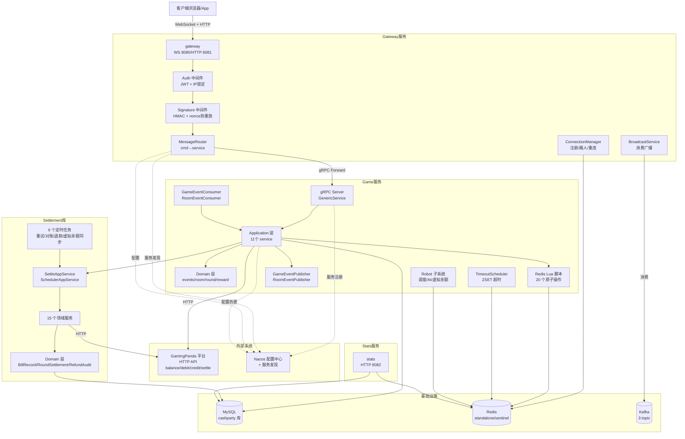

### 2.2 关键架构决策

| 决策 | 来源 | 说明 |
|------|------|------|
| Redis 作为实时状态主存,MySQL 异步持久化 | `game/application/game_event_handler.go` | 所有游戏状态(房间/玩家/座位/回合)在 Redis Lua 脚本中原子操作,通过 Kafka 事件异步落 DB |
| 短事务原则:禁止事务内 RPC | `settlement/application/doc.go:17-33` | 含 RPC 的用例由 Service 对 DB 写入片段开事务,避免长事务持锁 |
| per-node Kafka GroupID | `game/bootstrap/mq_helper.go:23-27` | 每节点消费全量,靠 Redis SetNX 互斥保证恰好一次 |
| 双层广播:Kafka(可靠) + Redis Pub/Sub(轻量) | `common/broadcast/factory.go` | 当前生产配置用 Redis Pub/Sub(`config/gateway.yaml:51`) |
| 平台 Settle 接口仅上报,不动资金 | `api/platform/mock_client.go:218-219` 注释 | 资金已由 Debit/Credit 移动,Settle 只记录结果 |
| 资金"内部记账 + 会话级派奖" | `settlement/service/round_settle_service.go:133` creditRound | round 级别只写 Success BillRecord(内部记账),实际 platform.Credit 延迟到 session 级 SessionPayoutService |

---

## 3. 模块分析

### 3.1 Game 模块(核心业务服务)

#### 3.1.1 职责

- 房间生命周期管理(创建/加入/选座/准备/开局/结束)
- 红包回合编排(发包/抢包/结算)
- 超时调度(座位/准备/抢包/发包/替补/机器人)
- 机器人子系统(调度/AI 行为/虚拟余额)
- 装配 settlement 模块,编排扣款/结算/退款
- 通过 Kafka 事件异步持久化到 MySQL
- gRPC 对外暴露 `GenericService.Forward`(网关转发)+ `SaveUser`

#### 3.1.2 功能清单

| 功能 | 入口 | 核心代码位置 |
|------|------|--------------|
| 启动编排 | `cmd/game/main.go::main` | `game/bootstrap/app.go::NewApplicationWithConfig` |
| 加入房间(观众) | gRPC Forward `join_room` | `game/application/room_app_service.go::JoinRoom` |
| 自动匹配加入 | gRPC Forward `auto_match` | `game/application/room_app_service.go::AutoMatchAndJoin` |
| 离开房间 | gRPC Forward `leave_room` | `game/application/room_app_service.go::LeaveRoom` |
| 排队 | gRPC Forward `enqueue`/`dequeue` | `game/application/room_app_service.go::Enqueue`/`Dequeue` |
| 选座 | gRPC Forward `select_seat` | `game/application/seat_app_service.go::SelectSeat` |
| 取消选座 | gRPC Forward `cancel_seat` | `game/application/seat_app_service.go::CancelSeat` |
| 玩家准备 | gRPC Forward `player_ready` | `game/application/seat_app_service.go::SetReady` |
| 开局 | Ready 超时触发 | `game/application/game_lifecycle_service.go::StartGame` |
| 发红包(玩家) | gRPC Forward `send_packet` | `game/application/packet_orchestrator.go::SendPacket` |
| 系统首轮发包 | StartGame | `game/application/packet_system_send.go::StartFirstRound` |
| 抢红包 | gRPC Forward `grab_packet` | `game/application/game_app_service.go::GrabPacket` → `grab_service.go::GrabPacket` |
| 单轮结算 | 抢完最后包异步触发 | `game/application/round_settlement_service.go::SettleRound` |
| 游戏结束 | 最后一轮结算后 | `game/application/game_lifecycle_endgame.go::EndGameWithOptions` |
| 超时处理 | TimeoutScheduler | `game/application/game_lifecycle_timeout.go::OnGrabTimeout`/`OnSendTimeout`/`OnReplaceTimeout` |
| 罚款 | OnSendTimeout | `game/application/penalty_service.go::ApplyPenalty` |
| 踢人补位 | OnSendTimeout(kick) | `game/application/game_lifecycle_endgame.go::handleKickAndReplace` |
| 自动补位 | 离开/被踢触发 | `game/application/room_app_service.go::tryAutoSubstitute` |
| 中断恢复 | AutoSubstitute 满 | `game/application/game_lifecycle_service.go::ResumeGame` |
| 机器人调度 | scanLoop | `game/application/robot/scheduler_service.go::scanRooms` |
| 机器人抢包 | OnPacketCreated | `game/application/robot/behavior_engine.go::OnPacketCreated` |
| 机器人发包 | OnRoundSettle | `game/application/robot/behavior_engine.go::OnRoundSettle` |
| 历史查询 | gRPC Forward `get_player_history` 等 | `game/application/history_service.go` |
| 用户保存 | gRPC SaveUser | `game/application/user_service.go::SaveUser` |
| 余额校验 | JoinAndAutoSeat / SetReady | `game/application/room_app_service.go::CheckBalanceForReady` |
| GameEvent 消费 | Kafka `cashparty.game.events` | `game/infrastructure/messaging/game_event_consumer.go` |
| RoomEvent 消费 | Kafka `cashparty.room.events` | `game/infrastructure/messaging/room_event_consumer.go` |
| 超时调度 | ZSET 轮询 | `game/scheduler/timeout_scheduler.go::checkTimeouts` |

#### 3.1.3 业务流程(抢红包核心)

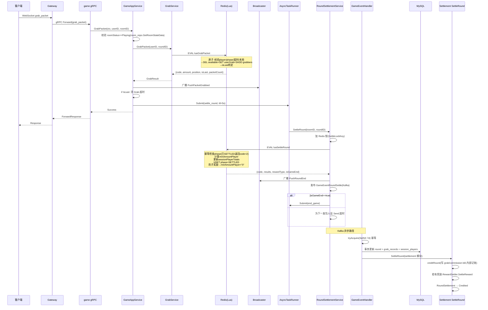

#### 3.1.4 核心代码分析

**Lua 原子操作(20 个脚本)**: 来源 `game/infrastructure/persistence/redis/scripts/registry.go`

关键脚本:
- `luaGrabPacket` (`packet.lua.go`): 抢包原子操作,7 个 KEYS,校验玩家/phase/超时/已抢 → 原子 DEL+SET+SADD → isLast 判定
- `luaSettleRound` (`round.lua.go`): 轮结算,幂等检查 phase,计算 minAmountPlayer,更新 totals,豹子奖励触发 minAmountPlayer="0"(系统补发包)
- `luaEndGame` (`round.lua.go`): 局结束,status Playing→Waiting,players→spectators 保持座位
- `luaAutoSubstitute` (`queue.lua.go`): 补位核心,找 queue 中第一个非 robot spectator → 转 player → 根据 room status 触发 countdown 或 ResumeGame
- `luaHandlePenalty` (`penalty.lua.go`): INCR penalty_count,>=2 kick

**循环依赖打破** (`game/bootstrap/container.go::InitAppServices`):
```
PacketOrchestrator.SetDeductFailureHandler(GameLifecycleSvc)
RoundSettlementSvc.SetGameEnder(GameLifecycleSvc)
GameLifecycleSvc.SetPacketInitiator(PacketOrchestrator)
GameLifecycleSvc.SetRoundSettler(RoundSettlementSvc)
```

### 3.2 Settlement 模块(结算/账务库)

#### 3.2.1 职责

- 资金扣款(首轮回合/后续回合/系统包/罚款)
- 单轮结算(grab/commission/reward 内部记账)
- 会话级派奖(实际 platform.Credit 移动资金)
- 游戏级上报(platform.Settle 仅记录结果)
- 退款申请/审批/执行
- 入账重试与对账
- 机器人虚拟余额管理
- 异常记录(业务 DLQ)

#### 3.2.2 功能清单

| 功能 | 入口 | 核心代码位置 |
|------|------|--------------|
| 首轮扣款 | PacketOrchestrator | `settlement/service/deduct_service.go::DeductForFirstRound` |
| 后续轮扣款 | PacketOrchestrator | `settlement/service/deduct_service.go::DeductForLaterRound` |
| 系统包扣款 | PacketOrchestrator | `settlement/service/deduct_service.go::DeductForSystemPacket` |
| 单轮结算 | GameEventHandler.handleRoundSettle | `settlement/service/round_settle_service.go::SettleRound` |
| 奖励结算 | SettleRound 内调 | `settlement/service/reward_settler.go::SettleReward` |
| 游戏结算 | GameEventHandler.handleSessionEnd | `settlement/service/game_settle_reporting_service.go::SettleGame` |
| 会话派奖 | SettleGame 内调 | `settlement/service/session_payout_service.go::CreditSessionPayouts` |
| 罚款扣款 | PenaltyService | `settlement/service/penalty_settlement_service.go::DeductPenaltyToPlatform` |
| 罚款分配 | OnReplaceTimeout | `settlement/service/penalty_settlement_service.go::DistributePenaltyFromPlatform` |
| 退款申请 | SettlementCheckService | `settlement/service/refund_apply_service.go::ApplyForRefund` |
| 退款审批+执行 | RefundProcessScheduler | `settlement/service/refund_execute_service.go::ApproveRefund` |
| 入账重试 | CreditRetryScheduler | `settlement/service/credit_retry_service.go::RetryCredit` |
| 游戏结算重试 | GameSettleRetryScheduler | `settlement/service/game_settle_reporting_service.go::RetryPlayerSettle` |
| 游戏结算超时兜底 | GameSettleTimeoutScheduler | `settlement/application/scheduler_app_service.go::SettleGameByTimeout` |
| 对账-首回合失败 | SettlementCheckScheduler | `settlement/service/settlement_check_service.go::CheckFirstRoundDeductFailure` |
| 对账-已扣未结 | SettlementCheckScheduler | `settlement/service/settlement_check_service.go::CheckDeductedButNotSettled` |
| 虚拟余额同步 | VirtualBalanceSyncScheduler | `settlement/application/scheduler_app_service.go::RunVirtualBalanceSync` |
| 余额校验 | RoomAppService | `settlement/service/balance_service.go::CheckBalanceForReady`/`CheckBalance` |
| 机器人识别 | 多处 | `settlement/service/robot_checker.go::IsRobot`(fail-closed) |

#### 3.2.3 业务流程(首回合扣款)

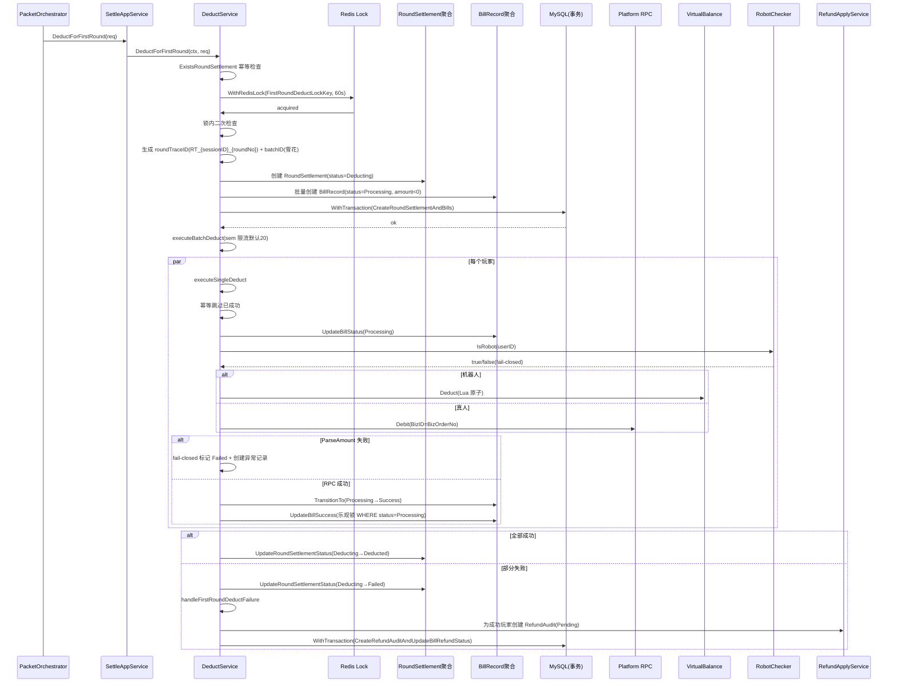

#### 3.2.4 核心代码分析

**确定性 ID 生成** (`settlement/service/trace_id_generator.go`): 所有 BizOrderNo/TraceID/RefundOrderNo/ExceptionNo 均确定性生成,重试可复现,支持平台侧基于 BizID 幂等:
- `GenerateRoundTraceID(sessionID, roundNo)` → `RT_{sessionID}_{roundNo}`
- `GenerateBizOrderNo(roundTraceID, billType, userID)` → `{roundTraceID}_{billType}_{userID}`
- `GenerateRefundOrderNo(billID)` → `REFUND_{billID}`
- `GenerateExceptionNo(billID, exceptionType)` → `EXC_{billID}_{exceptionType}`
- 唯一例外:`GenerateBatchID()` 用雪花 ID(非确定性,但不作为幂等键)

**关键设计 - 延迟 Credited 标记** (`round_settle_service.go:108-121`): 所有子结算(creditRound + rewardSettler)全部成功后才标记 RoundSettlement → Credited,避免 reward 失败但 round 被标 Credited 导致重试时早返回、reward 永远无法补偿。

**Processing 中间态**:
- 游戏级结算:`UpdateGameSettleStatusByUser(None→Processing)` RPC 前 → `Processing→Settled` 成功 / `Processing→None` 失败回滚
- 退款:`UpdateRefundAuditToProcessing(Approved→Processing)` RPC 前 → `Processing→Refunded` 成功 / `Processing→Pending` 失败回退

### 3.3 Gateway 模块(WebSocket 网关)

#### 3.3.1 职责

- WebSocket 连接接入与认证(JWT + IP 锁定)
- HTTP API(游戏列表/启动游戏,带 HMAC 签名)
- 消息路由(cmd → 后端 service via gRPC)
- 跨节点踢人(Redis Pub/Sub)
- 广播消息消费与本地分发
- 连接级心跳与超时

#### 3.3.2 功能清单

| 功能 | 入口 | 核心代码位置 |
|------|------|--------------|
| WS 升级 + 认证 | `GET /ws?token=xxx` | `gateway/server/server.go::handleWebSocket` → `middleware/auth.go::OnConnect` |
| HTTP 签名验证 | `/game/*` 路由组 | `gateway/middleware/signature.go::VerifySignature` |
| 游戏列表 | `GET /game/list` | `gateway/handler/game.go::GetGameList` |
| 启动游戏 | `POST /game/start` | `gateway/handler/game.go::StartGame` |
| 测试 Token | `POST /test/token`(dev) | `gateway/service/test.go::GenerateTestToken` |
| 消息路由 | WS readPump | `gateway/router/router.go::Route` |
| 本地命令 ping | WS | `gateway/router/router.go::handleLocalCommand` |
| 远端转发 | WS | `gateway/router/router.go::forwardToService` |
| 连接注册 | handleConnection | `gateway/connection/manager.go::Register` |
| 跨节点踢人 | Redis Pub/Sub | `gateway/connection/manager.go::subscribeKickChannel` |
| 重连处理 | handleConnection | `gateway/server/server.go::handleReconnect` |
| 广播消费 | Kafka/RedisPubSub | `gateway/broadcast/broadcast.go::handleBroadcastMessage` |
| 房间用户查询 | broadcastToRoom | `gateway/broadcast/broadcast.go::GetRoomUsers` |
| 健康检查 | `GET /health` | `gateway/health/health.go` |

#### 3.3.3 业务流程(WebSocket 请求)

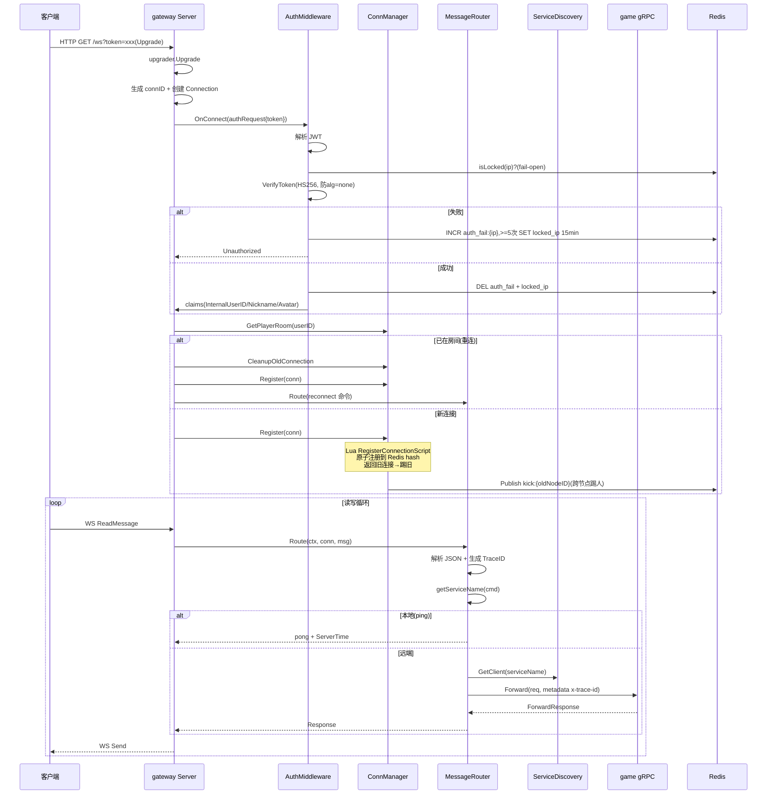

### 3.4 Common 模块(公共基础设施)

#### 3.4.1 职责

提供所有服务共享的基础设施抽象与实现:
- 异步任务执行器(panic recovery + per-task 超时)
- 广播抽象(Kafka + Redis Pub/Sub 双实现)
- 配置结构(13 个子配置,带默认值与校验)
- 雪花 ID 生成(时钟回拨处理 + Redis 节点自动分配)
- Kafka 封装(producer/consumer/retry/dlq)
- 分布式锁(redsync + Lua 释放防误删)
- 消息信封(Broadcast/Push/Error,统一 EventHeader)
- 调度器框架(Base + Registry + Metrics,并行 Stop)
- Redis key 单源真相(`rediskeys/keys.go`)
- 滑动窗口限流器(Lua 脚本)
- gRPC 服务发现(Nacos resolver)
- 工具(currency/strutil/trace/signature/converter/i18n/logger/mysql)

#### 3.4.2 关键设计

**`async/task_runner.go`**: 
- `Submit(taskID, ttl, task)`:加锁检查 closed → `wg.Add(1)` 释放锁 → goroutine 内 `defer wg.Done` + `defer recover` + `context.WithTimeout(rootCtx, ttl)` 派生 per-task ctx
- 反模式:禁止 task 内嵌套 go、禁止 context.Background、Submit 后立即 Stop+Wait

**`scheduler/registry.go`**:
- `StartAll`:串行启动,单个失败不中断,`errors.Join` 聚合
- `StopAll(timeout)`:**并行**停止,全局预算超时,避免单调度器卡死影响整体

**`idgen/snowflake.go`**: 
- 自定义纪元 `2026-01-01 00:00:00 UTC`(1735689600000)
- 位分配 `timestamp(41)+nodeID(10)+sequence(12)`,可用约 69 年到 2095
- 时钟回拨:≤5ms sleep 等待追上,>5ms 返回 `ErrClockMovedBackwards` 拒绝生成
- 节点自动分配:Redis INCR 序列 + SET NX 抢占 + 5min 心跳续约 + Lua 安全释放

**`kafka/consumer.go`**: 
- `Start` 循环:FetchMessage → processWithRetry(3 次指数退避 + jitter)→ DLQ(可选)→ CommitMessages(无论成功失败,避免毒消息永久阻塞)

**`lock/distributed_lock.go`**: 
- 基于 redsync,可选 watchdog(每 10s Extend 续约)
- 释放通过 Lua 脚本 `release_lock.lua`(GET 校验 token 后 DEL,防 TTL 过期后误删)

### 3.5 Stats 模块(统计服务)

#### 3.5.1 职责

提供 6 个统计查询接口(基于 MySQL 聚合 + Redis 缓存):
- Dashboard 总览
- 每小时/每日趋势
- 金额分布
- 房间排行
- 系统红包统计

#### 3.5.2 功能清单

| 功能 | 路由 | 核心代码 |
|------|------|----------|
| Dashboard | `GET /api/v1/stats/dashboard` | `stats/handler/stats_handler.go::GetDashboard` |
| 每小时趋势 | `GET /api/v1/stats/trend/hourly` | `GetHourlyTrend` |
| 每日趋势 | `GET /api/v1/stats/trend/daily` | `GetDailyTrend` |
| 金额分布 | `GET /api/v1/stats/distribution` | `GetAmountDistribution` |
| 房间排行 | `GET /api/v1/stats/rooms/ranking` | `GetRoomRanking` |
| 系统红包 | `GET /api/v1/stats/system-packets` | `GetSystemPacketStats` |

来源: `stats/handler/stats_handler.go::RegisterRoutes`

#### 3.5.3 核心指标

| 指标 | 来源表 | 计算方式 |
|------|--------|----------|
| 今日场次 | `game_sessions` | `COUNT(*) WHERE created_at ∈ range` |
| 活跃玩家 | `session_players` | `COUNT(DISTINCT user_id)` |
| 总佣金 | `rounds` | `SUM(commission)` |
| 罚款收入 | `bill_record` | `SUM(amount) WHERE bill_type=8 AND status=1` |
| 系统红包成本 | `rounds` | `SUM(total_amount) WHERE sender_type IN (system/system_forced/system_resume)` |
| 顺子数 | `special_rewards` | `COUNT(*) WHERE reward_type=1` |
| 豹子数 | `special_rewards` | `COUNT(*) WHERE reward_type=2` |
| 净利润 | `rounds` | = `total_commission` |

来源: `stats/repository/stats_repository.go`

---

## 4. 领域模型

### 4.1 类图

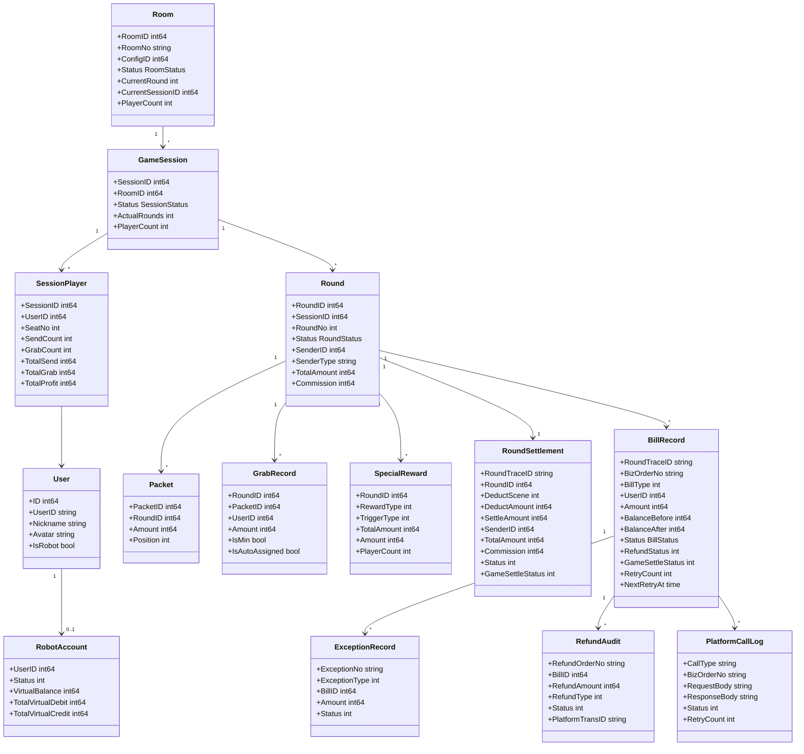

### 4.2 实体说明

| 实体 | 类型 | 来源 | 生命周期 |
|------|------|------|----------|
| Room | Entity | `game/domain/room/room.go` | 预创建,长期存在 |
| GameSession | Entity | `game/model/session.go` | 一局游戏,StartGame 创建,EndGame 完成 |
| Round | Entity | `game/model/round.go` | 一回合,发包创建,结算结束 |
| Packet | Value Object | `game/model/packet.go` | 预生成,抢完即固定 |
| GrabRecord | Entity | `game/model/round.go` | 抢包时创建,持久化 |
| SpecialReward | Entity | `game/model/reward.go` | 触发奖励时创建 |
| User | Entity | `game/model/user.go` | 长期存在 |
| RobotAccount | Entity | `game/model/robot_account.go` | 与 User 1:1,仅机器人 |
| BillRecord | Aggregate Root | `settlement/domain/bill.go` | 资金流水,长期保留 |
| RoundSettlement | Aggregate Root | `settlement/domain/round_settlement.go` | 一回合结算状态 |
| RefundAudit | Aggregate Root | `settlement/domain/refund.go` | 退款审核记录 |
| ExceptionRecord | Aggregate Root | `settlement/domain/exception.go` | 异常记录(业务 DLQ) |
| PlatformCallLog | Aggregate Root | `settlement/domain/platform_call_log.go` | 平台调用日志 |

### 4.3 状态机

#### 4.3.1 Room 状态机(房间级)

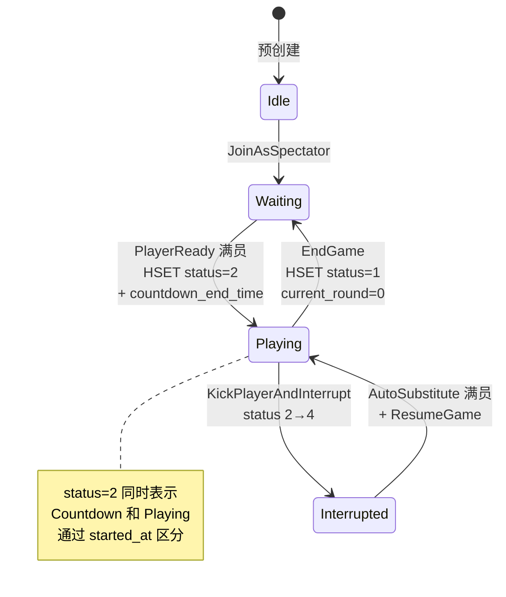

来源: `game/domain/room/room.go::RoomStatus`, `game/infrastructure/persistence/redis/scripts/room_seat.lua.go`

#### 4.3.2 Game Phase 状态机(回合级)

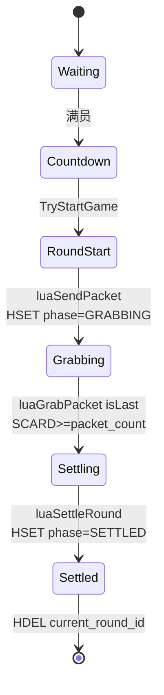

来源: `game/domain/game/game_state.go::GamePhase`, `game/infrastructure/persistence/redis/scripts/*.lua.go`

#### 4.3.3 BillRecord 状态机(账单级)

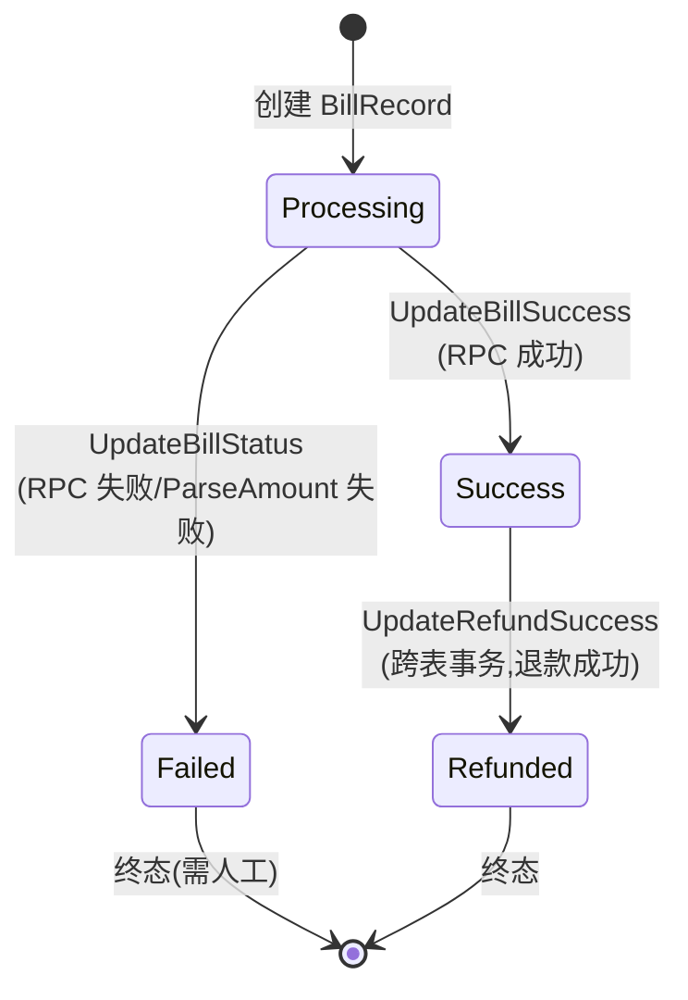

来源: `settlement/domain/bill.go::TransitionTo`(第 100-114 行)

#### 4.3.4 RoundSettlement 状态机(回合结算级)

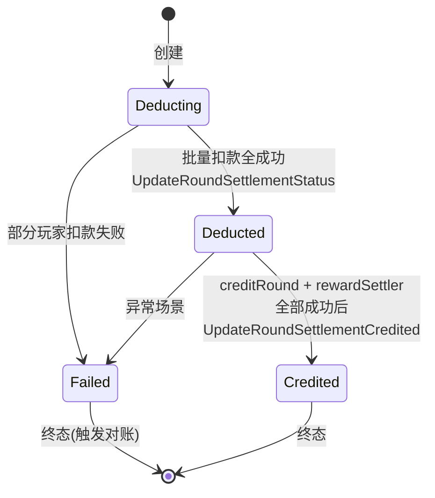

来源: `settlement/domain/round_settlement.go::TransitionTo`(第 64-78 行)

#### 4.3.5 RefundAudit 状态机(退款级)

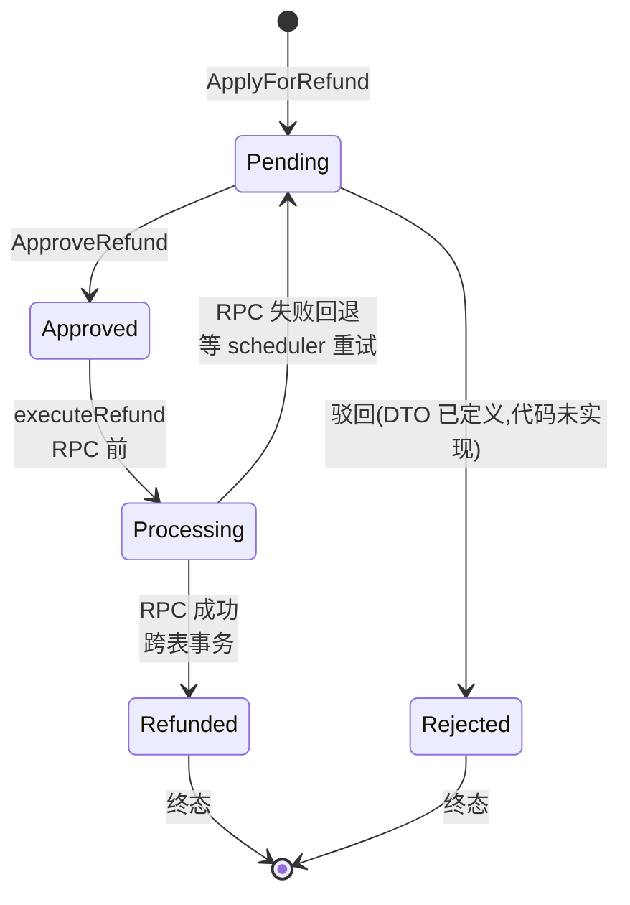

来源: `settlement/domain/refund.go::TransitionTo`(第 70-88 行)

### 4.4 业务约束

| 约束 | 来源 | 说明 |
|------|------|------|
| MaxPlayers=5 | `game/domain/room/room.go::MaxPlayers` | 固定 5 人同桌 |
| MaxRounds=10 | `scripts/init_rooms.go::roomConfigs` | 默认 10 回合一局(可配置) |
| CommissionRate=0.05 | `game/domain/game/game_state.go::CommissionConfig.Rate` | 5% 佣金抽成 |
| MaxPenaltyCount=2 | `game/domain/round/penalty.go::PenaltyPolicy` | 罚款 2 次踢出 |
| MaxRetryCount=3 | `settlement/dto/constants.go::MaxRetryCount` | 入账重试上限 |
| 金额使用分(int64) | `common/currency/money.go::Money` | 避免浮点误差 |
| 红包金额用 crypto/rand | `game/algorithm/packet_generator.go` + `CODING_STANDARD §6.4` | 资金安全 |
| 机器人/UI 用 math/rand | `game/application/avatar.go`, `game/application/robot/` | 非资金场景 |

---

## 5. 数据模型

### 5.1 数据库 ER 图

```mermaid
erDiagram
    room_configs ||--o{ rooms : "config_id"
    rooms ||--o{ game_sessions : "room_id"
    game_sessions ||--o{ session_players : "session_id"
    game_sessions ||--o{ rounds : "session_id"
    rounds ||--o{ packets : "round_id"
    rounds ||--o{ round_grab_records : "round_id"
    rounds ||--o{ special_rewards : "round_id"
    rounds ||--|| round_settlement : "round_id"
    rounds ||--o{ bill_record : "round_id"
    bill_record ||--o{ exception_record : "bill_id"
    bill_record ||--o{ refund_audit : "bill_id"
    bill_record ||--o{ platform_call_log : "biz_order_no"
    users ||--o| robot_accounts : "user_id"
    session_players }o--|| users : "user_id"

    room_configs {
        int64 id PK
        string name
        int64 room_fee
        int max_players
        int max_rounds
        int sort_order
        int status
    }
    rooms {
        int64 room_id PK
        string room_no UK
        int64 config_id FK
        int status
        int current_round
        int64 current_session_id
        int player_count
    }
    game_sessions {
        int64 session_id PK
        int64 room_id FK
        int64 config_id FK
        int status
        int actual_rounds
        int player_count
    }
    session_players {
        int64 id PK
        int64 session_id FK
        int64 user_id FK
        int seat_no
        int send_count
        int grab_count
        int64 total_send
        int64 total_grab
        int64 total_profit
    }
    rounds {
        int64 round_id PK
        int64 session_id FK
        int64 room_id FK
        int round_no
        int status
        int64 sender_id
        string sender_type
        int64 total_amount
        int64 commission
        int64 settle_trace_id
    }
    packets {
        int64 packet_id PK
        int64 round_id FK
        int64 amount
        int position
    }
    round_grab_records {
        int64 id PK
        int64 round_id FK
        int64 packet_id FK
        int64 user_id FK
        int64 amount
        int is_min
        int is_auto_assigned
    }
    special_rewards {
        int64 id PK
        int64 round_id FK
        int reward_type
        int trigger_type
        int64 total_amount
        int64 amount
        int player_count
    }
    users {
        int64 id PK
        string user_id UK
        string nickname
        string avatar
        bool is_robot
    }
    robot_accounts {
        int64 id PK
        int64 user_id UK_FK
        int status
        int64 virtual_balance
        int64 total_virtual_debit
        int64 total_virtual_credit
    }
    bill_record {
        int64 id PK
        string round_trace_id UK
        string biz_order_no UK
        int bill_type
        int64 room_id FK
        int64 session_id FK
        int64 round_id FK
        int64 user_id
        int64 amount
        int status
        int refund_status
        int game_settle_status
        int retry_count
    }
    round_settlement {
        int64 id PK
        string round_trace_id UK
        int64 round_id UK
        int64 room_id FK
        int64 session_id FK
        int deduct_scene
        int64 deduct_amount
        int64 settle_amount
        int64 sender_id
        int64 total_amount
        int64 commission
        int status
        int game_settle_status
    }
    refund_audit {
        int64 id PK
        string refund_order_no UK
        int64 bill_id FK
        int64 round_trace_id
        int64 user_id
        int64 refund_amount
        int refund_type
        int status
        string platform_trans_id
    }
    exception_record {
        int64 id PK
        string exception_no UK
        int exception_type
        int64 bill_id FK
        int64 round_trace_id
        int64 user_id
        int64 amount
        int status
    }
    platform_call_log {
        int64 id PK
        string call_type
        string biz_order_no FK
        string request_body
        string response_body
        int status
        int retry_count
    }
```

来源: `game/model/*.go`, `settlement/model/*.go`, `scripts/init_rooms.go::AutoMigrate`

### 5.2 表清单(15 张业务表 + 12 张 Nacos 表)

| 表名 | 来源 model | 主键 | 关键索引 |
|------|-----------|------|----------|
| `room_configs` | `game/model/config.go` | id | - |
| `rooms` | `game/model/room.go` | room_id | room_no UK, config_id, status, current_session_id |
| `game_sessions` | `game/model/session.go` | session_id | room_id, config_id, status |
| `session_players` | `game/model/session.go` | id | (session_id,user_id) UK, room_id, idx_user_joined |
| `rounds` | `game/model/round.go` | round_id | session_id, room_id, status, settle_trace_id, idx_session_roundno, idx_session_sender |
| `round_grab_records` | `game/model/round.go` | id | round_id, packet_id, session_id, user_id, idx_session_user |
| `packets` | `game/model/packet.go` | packet_id | round_id, room_id |
| `special_rewards` | `game/model/reward.go` | id | room_id, session_id, round_id |
| `users` | `game/model/user.go` | id | user_id UK, is_robot |
| `robot_accounts` | `game/model/robot_account.go` | id | user_id UK, status |
| `bill_record` | `settlement/model/bill.go` | id | (round_trace_id,bill_type,user_id) UK, biz_order_no UK, idx_user_status_session, idx_session_user_type |
| `round_settlement` | `settlement/model/bill.go` | id | round_trace_id UK, round_id UK, room_id, session_id, status |
| `exception_record` | `settlement/model/exception_record.go` | id | exception_no UK, exception_type, bill_id, round_trace_id |
| `refund_audit` | `settlement/model/refund.go` | id | refund_order_no UK, bill_id, status |
| `platform_call_log` | `settlement/model/platform_call_log.go` | id | call_type, biz_order_no, status |

来源: `scripts/init_rooms.go:72-90`(AutoMigrate 15 张表), `sql/nacos_init.sql`(Nacos 12 张表)

### 5.3 Redis Key 设计

所有 key 集中定义于 `common/rediskeys/keys.go`,前缀 `cashparty`,分隔符 `:`。按用途分组:

| 类别 | Key 示例 | 用途 | TTL |
|------|---------|------|-----|
| 房间 | `cashparty:room:hash:{roomID}` | 房间哈希(状态/配置) | 24h |
| 房间 | `cashparty:room:players:{roomID}` | 房间玩家 hash | 24h |
| 房间 | `cashparty:room:spectators:{roomID}` | 房间观众 hash | 24h |
| 房间 | `cashparty:room:seats:{roomID}` | 房间座位 hash | 24h |
| 房间 | `cashparty:room:queue:{roomID}` | 房间排队 ZSET | 24h |
| 用户 | `cashparty:player:room:{userID}` | 玩家当前房间 | 24h |
| 用户 | `cashparty:user:user_id:{userID}` | 用户缓存 | - |
| 回合 | `cashparty:round:state:{roundID}` | 回合状态 hash | 24h |
| 回合 | `cashparty:round:available_packets:{roundID}` | 可用红包 LIST | 24h |
| 回合 | `cashparty:round:grabbers:{roundID}` | 抢包者 SET | - |
| 红包 | `cashparty:packet:info:{packetID}` | 红包详情 hash | 24h |
| 红包 | `cashparty:round:grabbed:{roundID}:{userID}` | 用户已抢标记 | 24h |
| 锁 | `cashparty:lock:send_packet:{roomID}:{userID}` | 发包锁 | 10s |
| 锁 | `cashparty:settle:lock:round:{roundID}` | 结算锁 | 30s |
| 锁 | `cashparty:settle:lock:first_round:{sessionID}` | 首轮扣款锁 | 60s |
| 锁 | `cashparty:robot:assign:{robotUserID}` | 机器人分配锁 | 10s |
| 超时 | `cashparty:timeout:{timeoutType}` | 超时 ZSET | - |
| 惩罚 | `cashparty:penalty:count:{roomID}:{userID}` | 惩罚计数 | 24h |
| 事件幂等 | `cashparty:game:event:processed:{traceID}` | GameEvent 已处理 | 7d |
| 事件幂等 | `cashparty:room:event:processed:{eventID}` | RoomEvent 已处理 | 7d |
| 网关 | `cashparty:gateway:conn:{userID}` | 连接映射 hash | 24h |
| 网关 | `cashparty:gateway:kick:{nodeID}` | 跨节点踢人频道 | - |
| 网关 | `cashparty:gateway:locked_ip:{ip}` | IP 锁定 | 15min |
| 网关 | `cashparty:gateway:nonce:{nonce}` | 签名防重放 | 10min |
| 限流 | `cashparty:ratelimit:cmd:{cmd}:{userID}` | 滑动窗口 ZSET | 窗口期 |
| 机器人 | `cashparty:robot:pool:available` | 可用机器人 SET | - |
| 机器人 | `cashparty:robot:virtual_balance:{userID}` | 虚拟余额 | - |
| 机器人 | `cashparty:robot:virtual_balance:dirty` | 脏数据 SET | - |
| 机器人 | `cashparty:robot:user_ids` | 机器人 ID SET | - |
| ID 生成 | `cashparty:idgen:node_id_seq` | nodeID 序列 | - |
| ID 生成 | `cashparty:idgen:node_id:alloc:{nodeID}` | nodeID 占用 | 1h |
| Scheduler | `cashparty:scheduler:credit_retry:lock` | 调度器锁 | 60s |

来源: `common/rediskeys/keys.go`

### 5.4 一致性方案

| 场景 | 方案 | 来源 |
|------|------|------|
| Redis 实时状态 ↔ MySQL 持久化 | Kafka 事件异步落库 + GameEventHandler 幂等检查 | `game/application/game_event_handler.go` |
| Redis 虚拟余额 ↔ MySQL robot_accounts | VirtualBalanceSyncScheduler 30s 周期同步(SPOP 原子弹出) | `settlement/scheduler/virtual_balance_sync.go` |
| 多节点 Kafka 消费幂等 | Redis SetNX 7d TTL 互斥,失败释放锁让 Kafka 重试 | `game/infrastructure/messaging/game_event_consumer.go` |
| 跨节点连接踢人 | Redis Pub/Sub `kick:{nodeID}` 频道 | `gateway/connection/manager.go::subscribeKickChannel` |
| 分布式锁释放安全 | Lua 脚本 GET 校验 token 后 DEL | `common/lock/scripts/release_lock.lua.go` |

---

## 6. MQ/Event 模型

### 6.1 Kafka Topic 清单

来源: `common/kafka/topics.go:5-13`

| Topic | 用途 | Producer | Consumer | GroupID |
|-------|------|----------|----------|---------|
| `cashparty.game.events` | 游戏事件(4 种) | `game/infrastructure/messaging/game_event_publisher.go` | `game/infrastructure/messaging/game_event_consumer.go` | `game-events-{nodeID}` |
| `cashparty.room.events` | 房间事件(10 种) | `game/infrastructure/messaging/room_event_publisher.go` | `game/infrastructure/messaging/room_event_consumer.go` | `game-room-events-{nodeID}` |
| `cashparty.gateway.broadcast` | 网关广播 | `common/broadcast/kafka_broadcaster.go` | `gateway/broadcast/broadcast.go` | `gateway-broadcast-{nodeID}` |

注: 当前生产配置 `config/gateway.yaml:51` 使用 `redis_pubsub`,即 gateway 广播走 Redis Pub/Sub 频道 `cashparty:gateway:broadcast`,Kafka 实现保留作为可选高可靠方案。

### 6.2 GameEvent(4 种)

来源: `game/domain/events/game_event.go:11-16`

| EventType | Payload | 触发点 | 消费处理 |
|-----------|---------|--------|----------|
| `session_start` | SessionStartData(RoomNo/ConfigID/RoomFee/MaxRounds/Players) | StartGame | handleSessionStart: 创建 session + players |
| `packet_created` | PacketCreatedData(SenderID/TotalAmount/Commission/Packets) | 发包后 | handlePacketCreated: 更新 round + 创建 packets + 触发 robot.OnPacketCreated |
| `round_settle` | RoundSettleData(RoundNo/Results/RewardType) | SettleRound 后 | handleRoundSettle: 更新 round + grab_records + session_players + 调 settlement.SettleRound |
| `session_end` | SessionEndData(ActualRounds/EndReason/FinalResults) | EndGameWithOptions 后 | handleSessionEnd: 更新 session + player profits + 调 settlement.SettleGame |

**消息结构**: `GameEvent` 嵌入 `EventHeader`(EventID/TraceID/Timestamp/Version) + EventType + RoomID + SessionID + RoundID + Payload(json.RawMessage)

**消费流程** (`game_event_consumer.go::HandleEvent`):
1. 解析 GameEvent,恢复 TraceID 到 context
2. `tryAcquire`: SetNX `cashparty:game:event:processed:{traceID}` 7d TTL(fail-closed,Redis 故障返回 error 触发 Kafka 重试)
3. 已处理跳过
4. 转发到 GameEventHandler
5. 处理失败:释放锁(release_lock.lua 原子校验 token 后 DEL)让 Kafka 重试
6. 处理成功:保留锁作为 7d 幂等标记

**重试与幂等**:
- Kafka 重试:Handler 返回 error 时不 commit offset,Kafka 重投(无上限)
- Redis 幂等:SetNX 7d TTL 防重复消费
- DLQ:无独立 DLQ,通过 ExceptionRecord 表充当业务 DLQ

### 6.3 RoomEvent(10 种)

来源: `game/domain/events/room_event.go:13-23`

| EventType | 触发点 |
|-----------|--------|
| `spectator_join`/`spectator_leave` | JoinRoom/LeaveRoom |
| `seat_select`/`seat_cancel` | SelectSeat/CancelSeat |
| `player_ready` | SetReady |
| `spectator_kick` | KickPlayerAndInterrupt |
| `player_reconnect` | handleReconnect |
| `queue_join`/`queue_leave` | Enqueue/Dequeue |
| `substitute` | AutoSubstitute |

**消费处理** (`room_event_consumer.go::handleMessage`): 所有已知事件统一调用 `syncRoomCounts`(Pipeline 读 players/spectators HLen → UpdateRoom),用 EventID 作为幂等键。

### 6.4 广播消息

来源: `common/message/broadcast.go`

`BroadcastMessage` 嵌入 EventHeader + TargetType(room/user) + TargetID/UserIDs/ExcludeID + Event + Data(json.RawMessage)。

gateway `BroadcastService.handleBroadcastMessage` 收到后转 `PushMessage` → 按 TargetType 分发:
- `TargetTypeUser`: 遍历 UserIDs → 本地连接过滤 → BroadcastToUser
- `TargetTypeRoom`: GetRoomUsers(读 Redis players/spectators hash) → 排除 excludeUserID → 本地连接过滤 → 发送

### 6.5 消息信封

所有消息(Kafka + Redis Pub/Sub)统一使用 `EventHeader`:
- `EventID`: uuid(消息唯一标识)
- `TraceID`: 链路追踪 ID
- `Timestamp`: Unix 毫秒
- `Version`: 1

来源: `common/message/header.go`

---

## 7. 核心业务流程

### 7.1 一局游戏完整流程

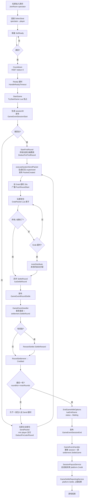

### 7.2 超时处理流程

| 超时类型 | 默认时长 | 处理逻辑 | 资金影响 |
|----------|----------|----------|----------|
| Seat | 30s | `SeatAppService.HandleSeatTimeout` 踢出 spectator | 无 |
| Ready | 3s | `SeatAppService.HandleReadyTimeout` 触发 StartGame | 无 |
| Grab | 20s | `GameAppService.OnGrabTimeout` → AutoDistribute(未抢的自动分配) → SettleRound | 未抢的红包自动分配 |
| Send | 30s | `GameAppService.OnSendTimeout` → ApplyPenalty(扣罚款) → 若 KickRequired: handleKickAndReplace;否则 ForceSendPacketForPlayer | 扣惩罚金 |
| Replace | 30s | `GameAppService.OnReplaceTimeout` → DistributePenaltyFromPlatform(分发惩罚金) → EndGameWithOptions | 分发惩罚金 |
| Robot | 5s | `RobotBehaviorEngine.HandleRobotTimeout` 执行 robot action | 无(虚拟余额) |

来源: `game/scheduler/timeout_scheduler.go`, `game/application/game_lifecycle_timeout.go`

### 7.3 机器人调度流程

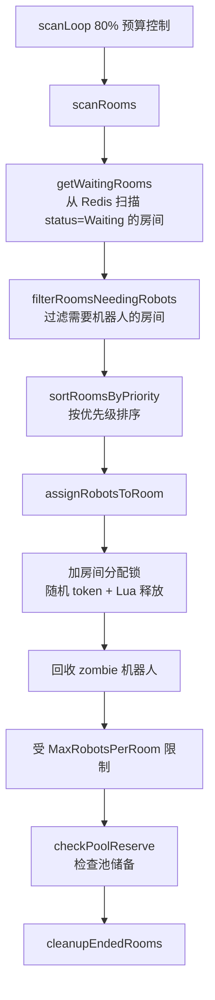

来源: `game/application/robot/scheduler_service.go::scanRooms`

---

## 8. 架构 Review

### 8.1 优点

#### 8.1.1 分层设计
- 严格 DDD 分层:Application → Domain → Infrastructure,职责清晰
- settlement 模块作为独立库被 game 装配,通过 Adapter 解耦反向依赖(`game/infrastructure/adapter/`)
- 领域聚合根(BillRecord/RoundSettlement/RefundAudit)有状态机守卫方法 `TransitionTo`

#### 8.1.2 模块隔离
- common 模块作为公共基础设施,被所有服务依赖,无反向依赖
- settlement domain 层定义 `UserService`/`FeeCalculator`/`RobotAccountStore` 接口,由 game 层实现并注入,避免 settlement → game 反向依赖

#### 8.1.3 设计模式
- **门面模式**: `SettleAppService` / `SchedulerAppService` 作为 settlement 统一入口
- **模板方法**: `packet_round_init.go::initRoundCore` 5 步模板,三个扣费实现
- **适配器模式**: `FeeCalculatorAdapter` / `UserSaverAdapter` / `robotAccountStoreAdapter`
- **策略模式**: `BroadcastFactory` 根据 mode 创建 Kafka/RedisPubSub broadcaster
- **注册表模式**: `SchedulerRegistry` 集中管理调度器,`rediskeys/keys.go` 集中管理 key

#### 8.1.4 扩展能力
- Lua 脚本通过 `cRedis.NewScript` 注册,新增脚本只需注册
- 调度器实现 `Scheduler` 接口即可注册到 Registry
- 平台客户端通过 `ClientFactory` 支持 gamingpanda/mock 切换
- 限流配置支持热更新(`UserLimiter.UpdateConfigs`)

#### 8.1.5 资金安全设计
- 多层幂等防线(业务层检查 + 分布式锁 + DB 唯一索引 + 乐观锁 + Kafka SetNX)
- fail-closed 原则(ParseAmount 失败、RobotChecker Redis 不可用一律标记 Failed)
- 确定性 ID 生成支持重试幂等
- Processing 中间态支持 RPC 失败回滚
- 短事务原则(禁止事务内 RPC)

### 8.2 问题

详见第 9 节。

---

## 9. 潜在问题

### 9.1 架构问题

| 问题 | 位置 | 影响 | 优化建议 |
|------|------|------|----------|
| 循环依赖通过 setter 注入打破 | `game/bootstrap/container.go::InitAppServices` | 启动顺序敏感,易引入 nil panic | 考虑引入事件总线或重构为单向依赖 |
| God Service: GameAppService 作为 facade 转发 | `game/application/game_app_service.go` | 职责聚合,但子 service 间耦合通过 setter 注入 | 维持现状,但需文档化依赖关系 |
| settlement domain Transaction 接口扩展 9 个子 repo 访问器 | `settlement/domain/repository/transaction.go` | 事务边界泄漏到 domain 接口 | 可考虑闭包风格 `WithTransaction(func(tx) error)` 隐藏子 repo |
| Room status=2 同时表示 Countdown/Playing | `game/domain/room/room.go` | 语义混淆,依赖 started_at 字段区分 | 拆分为独立状态或用 phase 字段明确 |
| Domain 逻辑泄漏到 Lua 脚本 | `game/infrastructure/persistence/redis/scripts/*.lua.go` | 业务规则分散,难测试 | 维持现状(Lua 原子性必要),但需文档化每个脚本的业务语义 |

### 9.2 工程问题

| 问题 | 位置 | 影响 | 优化建议 |
|------|------|------|----------|
| Round update 缺乐观锁 | `game/infrastructure/persistence/mysql/round_repository.go` | 并发场景下理论风险 | 添加 `WHERE status = ?` 条件 |
| Kafka 消费者 per-node GroupID | `game/bootstrap/mq_helper.go` | 每节点消费全量,依赖 Redis SetNX 幂等 | 高负载下 Redis 压力大,可考虑 partition 分配 |
| 网关 TTL 续约逻辑未见调用 | `gateway/connection/manager.go::RenewConnectionTTL` | 连接 24h 后可能被误清理 | 需要人工确认:是否在别处调用,或为缺口 |
| AutoDistribute 自动分配公平性 | `game/application/grab_service.go::AutoDistribute` | 玩家故意不抢可能获益 | 业务设计,可加反作弊规则 |
| 网关 roomUsersCache 超 10000 全量清空 | `gateway/broadcast/broadcast.go:147-197` | 缓存抖动,命中率突降 | 改用 LRU 淘汰策略 |
| ExceptionRecord 无自动处理流程 | `settlement/domain/exception.go` | 需人工介入,堆积风险 | 增加告警 + 人工处理 SLA |
| platform_call_log 无自动对账 | `settlement/service/settlement_check_service.go` | 平台侧与本地记录不一致难以发现 | 增加 platform_call_log ↔ bill_record 对账 |

### 9.3 分布式问题

| 问题 | 位置 | 影响 | 优化建议 |
|------|------|------|----------|
| Kafka 消费 fail-closed 可能阻塞 | `game/infrastructure/messaging/game_event_consumer.go` | Redis 不可用时返回 error,Kafka 重投可能压垮 | 增加退避 + 死信告警 |
| Redis 单点故障影响全局 | 所有服务依赖 Redis | Redis 宕机游戏不可用 | sentinel 模式已支持,建议生产部署 |
| 退款无次数上限 | `settlement/service/refund_execute_service.go` | RPC 持续失败会无限重试 | 增加最大重试次数 + 告警 |
| 跨服务 TraceID 依赖 metadata | `gateway/router/router.go:168` | gRPC metadata 丢失则链路断 | 已有兜底自动生成,但链路不完整 |
| 分布式锁 watchdog 可选 | `common/lock/distributed_lock.go` | 未启用 watchdog 时锁可能提前过期 | 资金类锁建议强制启用 watchdog |
| 虚拟余额同步失败重新 SAdd 回 dirtyKey | `settlement/scheduler/virtual_balance_sync.go` | 单条失败阻塞整批 | 已是合理设计(下次重试),但需监控堆积 |

---

## 10. 重构建议

### 10.1 短期(低风险)

1. **Round update 添加乐观锁**: `round_repository.go` 的 Update 方法添加 `WHERE status = ?` 条件
2. **网关 roomUsersCache 改 LRU**: 替换全量清空为 LRU 淘汰
3. **退款重试增加上限**: `RefundExecuteService` 增加最大重试次数 + 告警
4. **platform_call_log 对账**: 增加 `platform_call_log ↔ bill_record` 一致性检查 scheduler

### 10.2 中期(中风险)

1. **Room status 语义明确化**: 拆分 Countdown/Playing 为独立状态或引入 phase 字段
2. **ExceptionRecord 告警机制**: 增加 Prometheus 指标 + AlertManager 告警
3. **Kafka 消费退避优化**: Redis 不可用时增加退避,避免压垮
4. **资金类锁强制 watchdog**: `WithRedisLock` 区分资金锁/非资金锁,资金锁强制启用

### 10.3 长期(高风险)

1. **循环依赖重构**: 引入事件总线替代 setter 注入
2. **Lua 脚本业务语义文档化**: 每个脚本补充业务规则文档
3. **Domain 事务接口简化**: 闭包风格隐藏子 repo
4. **多机房容灾**: Redis cluster + MySQL 主从 + Kafka 多机房

---

## 11. 资金安全专项

### 11.1 资金流向

#### 11.1.1 首轮发包扣款(分摊)

```
所有玩家 → DeductForFirstRound → Platform
firstRoundFee = roomFee / maxPlayers (每人分摊)
```
来源: `packet_round_init.go::initRoundAndDeduct`, `game/domain/room/room.go::CalculateRequiredFee`

#### 11.1.2 后续轮发包扣款(min player 全额)

```
上一轮最小金额玩家 → DeductForLaterRound → Platform
laterRoundsFee = roomFee * (maxRounds - 1)
```
来源: `packet_round_init.go::initLaterRoundAndDeduct`

#### 11.1.3 系统包扣款

```
→ DeductForSystemPacket → Platform (平台账户内部记账,无 RPC)
```
来源: `packet_round_init.go::initSystemRoundAndDeduct`

#### 11.1.4 抢包资金流(内部记账)

```
红包总额 (packet total_amount)
  → 抢包玩家获得 (按 PacketGenerator 预分配金额)
  → 佣金 (commission = totalAmount * 0.05) 抽成
```
抢包只改 Redis 状态,实际入账通过 `GameEventRoundSettle` → `SettleRound` (settlement 模块) 异步落账。round 级别只写 Success BillRecord(内部记账),实际 platform.Credit 延迟到 session 级。

来源: `settlement/service/round_settle_service.go::creditRound`(第 133 行)

#### 11.1.5 会话级派奖(实际资金移动)

```
SessionPayoutService.CreditSessionPayouts
  → platform.Credit (派发玩家整局 payout)
  → 创建 SessionCredit BillRecord (Processing → Success)
```
来源: `settlement/service/session_payout_service.go::CreditSessionPayouts`(第 63 行)

#### 11.1.6 罚款资金流

```
违规玩家 → ApplyPenalty
  → luaHandlePenalty (INCR count, 记录)
  → DeductPenaltyToPlatform (扣款到平台,真人 platform.Debit / 机器人 virtualBalance.Deduct)
  → (Replace 超时) DistributePenaltyFromPlatform (平台分发给非排除玩家,内部记账)
```
来源: `game/application/penalty_service.go`, `game/application/game_lifecycle_timeout.go::OnReplaceTimeout`

#### 11.1.7 退款资金流

```
RefundApplyService.ApplyForRefund (创建 RefundAudit Pending)
  → RefundProcessScheduler 自动审批 (FirstRoundFail 类型)
  → RefundExecuteService.ApproveRefund → executeRefund
  → platform.Credit (BizID=RefundOrderNo, 平台幂等)
  → 跨表事务: refund_audit Processing→Refunded + bill Success→Refunded
```
来源: `settlement/service/refund_apply_service.go`, `settlement/service/refund_execute_service.go`

#### 11.1.8 游戏级上报(仅记录,不动资金)

```
GameSettleReportingService.settlePlayer
  → platform.Settle (上报 bet_amount/pay_out/result,资金已由 Debit/Credit 移动)
```
来源: `settlement/service/game_settle_reporting_service.go::settlePlayer`(第 221 行), `api/platform/mock_client.go:218-219` 注释

### 11.2 账务一致性

**双边记账原则**:
- 罚款扣款:创建 playerBill(amount<0,扣玩家) + platformBill(amount>0,平台收入),事务 `CreateBillsPair` 保证配对
- 罚款分配:创建平台支出 bill(amount<0) + 玩家收入 bills(amount>0,均 Success)
- 奖励:创建平台支出 bill + 玩家收入 bills(均 Success)

**账务平衡公式**(每回合):
```
∑(玩家抢包金额) + 佣金 = 红包总额
∑(扣款) = ∑(入账) + 佣金 + 平台支出
```

来源: `settlement/service/penalty_settlement_service.go::DeductPenaltyToPlatform`(第 71 行 CreateBillsPair)

### 11.3 幂等设计

**BizOrderNo 生成规则**(确定性,重试可复现):
- `GenerateBizOrderNo(roundTraceID, billType, userID)` → `{roundTraceID}_{billType}_{userID}`
- roundTraceID 本身也确定性:`RT_{sessionID}_{roundNo}`、`PENALTY_DED_{roomID}_{sessionID}`、`GAME_SETTLE_{sessionID}`、`SESSION_CREDIT_{sessionID}_{userID}`

**多层防线**:
1. **业务层幂等检查**(前置):ExistsRoundSettlement / GetBillByRoundTypeAndUser / IsPlayerGameSettled 等
2. **分布式锁**(并发防护):所有写入用例通过 `lock.WithRedisLock`(redsync,随机 token + Lua 释放)
3. **DB 唯一索引**(兜底):(round_trace_id, bill_type, user_id) 复合唯一、biz_order_no 唯一、refund_order_no 唯一
4. **乐观锁**(状态机防护):所有状态更新 `WHERE status = ?`,RowsAffected == 0 视为幂等成功
5. **Kafka 消费幂等**:SetNX 7d TTL,处理失败释放锁让重试
6. **平台侧幂等**:所有 platform RPC 带 BizID,平台基于 BizID 去重

来源: `settlement/service/trace_id_generator.go`, `settlement/infrastructure/persistence/mysql/bill_repository.go`

### 11.4 对账机制

**SettlementCheckService**(2 项检查):

1. **CheckFirstRoundDeductFailure**(回溯 10min):
   - 查询 `GetFailedFirstRoundSettlements`(deduct_scene=FirstRoundShare AND status=Failed)
   - 对 Success 且 RefundStatus=None 的 bill 创建退款申请(RefundType=FirstRoundFail)
   - 后续由 RefundProcessScheduler 自动审批并执行 platform.Credit 退款

2. **CheckDeductedButNotSettled**(回溯 5min):
   - 查询 `GetDeductedButNotSettled`(status=Deducted AND settle_amount IS NULL)
   - **创建 ExceptionRecord(DeductedNotSettled) 供人工调查**,不自动退款(避免游戏实际进行时误退款)

**未覆盖场景**(代码中未见):
- 平台侧实际扣款/入账与本地 bill_record 不一致的对外对账(可能依赖平台侧对账或人工 ExceptionRecord 处理)
- bill_record 与 platform_call_log 的一致性对账

来源: `settlement/service/settlement_check_service.go`

### 11.5 异常恢复

**ExceptionRecord(业务 DLQ)**:
- 扣款失败(DeductService、PenaltySettlementService):创建 ExceptionRecord(DebitFailed)
- 入账重试超限(CreditRetryService,>3 次):创建 ExceptionRecord(CreditRetryExceed)
- ParseAmount 失败(多个 service):fail-closed 创建 ExceptionRecord
- 已扣款未结算(SettlementCheckService):创建 ExceptionRecord(DeductedNotSettled)
- ExceptionRecord.Status 仅有 Pending(0),需人工处理

**重试策略**:
- HTTP 层(GamingPandaClient):MaxRetries=3,平方退避(attempt² * 1s,max 30s),仅重试 network error / 5xx
- 业务层入账重试(CreditRetryService):MaxRetryCount=3,指数退避(base * 2^retryCount,base=5s,max=5min)
- 业务层会话派奖重试(SessionPayoutService):同上指数退避
- 业务层退款重试(RefundExecuteService):RPC 失败回退到 Pending,由 RefundProcessScheduler(1m 间隔)持续重试,无次数上限
- Kafka 重试:Handler 返回 error 时不 commit offset,Kafka 重投(无上限,依赖 Redis 幂等抢占)

来源: `settlement/domain/exception.go`, `api/platform/gamingpanda_client.go::doPOSTWithRetry`, `settlement/service/credit_retry_service.go`

### 11.6 补偿机制

**6 个 scheduler 持续扫描失败记录并重试**:
- CreditRetryScheduler(30s):扫描 Processing/Failed 入账 bill,逐条重试 platform.Credit
- GameSettleRetryScheduler(30s):扫描 GameSettleStatusFailed 的会话,对未结算玩家 RetryPlayerSettle
- GameSettleTimeoutScheduler(5m):扫描超时(1h)未结算的会话,强制 SettleGame
- RefundProcessScheduler(1m):扫描 Pending 退款,自动审批 FirstRoundFail 类型
- SettlementCheckScheduler(5m):对账发现异常,触发退款或异常记录
- VirtualBalanceSyncScheduler(30s):Redis 脏虚拟余额批量同步到 DB

**补偿层级**:
```
Kafka 重试(实时) → 业务层指数退避重试(秒级) → Scheduler 补偿(分钟级) → ExceptionRecord 人工介入(终极兜底)
```

### 11.7 资金安全防线汇总

| 防线 | 位置 | 机制 |
|------|------|------|
| Lua 原子性 | 所有 Lua 脚本 | 单脚本多 key 原子操作 |
| 幂等-Lua | luaSettleRound code=2 | 已结算跳过 |
| 幂等-DB | GameEventHandler | session/round status 检查 |
| 幂等-GrabRecord | FirstOrCreateGrabRecord | 防重复插入 |
| 幂等-Kafka | game_event_consumer | SetNX 7 天 TTL |
| 分布式锁 | PacketOrchestrator/RoundSettlement | SendPacketLockKey/SettleLockKey |
| 扣费失败回调 | HandleDeductFailure | 中断游戏防止资金漏洞 |
| fail-closed | Kafka consumer | 业务失败不 commit offset |
| 顺序保证 | Kafka key | roomID/sessionID hash 到同 partition |
| PacketGenerator | crypto/rand | 红包金额安全随机 |
| 状态机守卫 | TransitionTo | 非法转换返回 error |
| 乐观锁 | WHERE status = ? | 终态拒绝覆盖 |
| DB 唯一索引 | (round_trace_id, bill_type, user_id) | 重复创建最后防线 |
| 确定性 ID | BizOrderNo/TraceID | 重试可复现,平台侧幂等 |
| Processing 中间态 | GameSettle/Refund | RPC 失败回滚支持重试 |
| 短事务原则 | 禁止事务内 RPC | 避免长事务持锁 |
| 业务 DLQ | ExceptionRecord | 异常记录人工介入 |

---

## 12. 定时任务(Job)清单与必要性评估

### 12.1 Game 模块定时任务

| Job | 文件 | 作用 | 触发频率 | 必要性 | 说明 |
|-----|------|------|----------|--------|------|
| TimeoutScheduler | `game/scheduler/timeout_scheduler.go` | ZSET 轮询处理 6 种超时(Seat/Ready/Grab/Send/Replace/Robot) | CheckInterval=1s | **必要** | 游戏核心机制,超时驱动状态流转 |

### 12.2 Settlement 模块定时任务(6 个)

所有 scheduler 都是薄壳,继承 `csched.BaseScheduler`,仅实现 `execute(ctx)` 委托给 `SchedulerAppService`。

| Job | 文件 | 作用 | Interval | InitialDelay | LockTTL | Limit | 必要性 | 说明 |
|-----|------|------|----------|--------------|---------|-------|--------|------|
| CreditRetryScheduler | `settlement/scheduler/credit_retry_scheduler.go` | 拉取可重试入账账单(amount>0,Processing/Failed 且未超重试上限)并逐条重试 platform.Credit | 30s | 10s | 60s | 100 | **必要** | 入账 RPC 失败的核心补偿通道,配合指数退避避免压垮平台 |
| GameSettleRetryScheduler | `settlement/scheduler/game_settle_retry_scheduler.go` | 拉取游戏级结算失败的会话,对未结算玩家执行 RetryPlayerSettle | 30s | 15s | 60s | - | **必要** | 游戏级结算失败后的补偿通道 |
| GameSettleTimeoutScheduler | `settlement/scheduler/game_settle_timeout_scheduler.go` | 拉取超时(1h)未完成游戏级结算的会话(所有回合 Credited 但 GameSettleStatus=None)并强制结算 | 5m | 1m | 300s | 100 | **必要** | 兜底机制,处理 SettleGame 事件丢失或失败导致长期未结算的会话 |
| RefundProcessScheduler | `settlement/scheduler/refund_process_scheduler.go` | 分页拉取 Pending 退款审核记录,对 FirstRoundFail 类型自动审批(ApproveRefund)触发 executeRefund | 1m | 30s | 120s | 100 | **必要** | 首回合扣款失败的自动退款补偿通道 |
| SettlementCheckScheduler | `settlement/scheduler/settlement_check_scheduler.go` | 依次执行 CheckFirstRoundDeductFailure(回溯 10min)与 CheckDeductedButNotSettled(回溯 5min)两项一致性检查 | 5m | 1m | 300s | - | **必要** | 对账核心,发现资金异常并触发退款或异常记录 |
| VirtualBalanceSyncScheduler | `settlement/scheduler/virtual_balance_sync.go` | 将 Redis 中脏的机器人虚拟余额批量同步到 DB(SPOP 原子弹出,处理失败重新 SAdd 回 dirtyKey) | 30s | 0s | 35s | - | **必要** | 机器人虚拟余额的持久化通道,Redis 宕机后可从 DB 恢复 |

### 12.3 Job 必要性总结

所有 7 个定时任务(1 个 Game + 6 个 Settlement)**均为必要**,各自承担不可替代的职责:

- **TimeoutScheduler**: 游戏核心机制,无替代方案
- **CreditRetryScheduler**: 入账 RPC 失败补偿,无其他通道
- **GameSettleRetryScheduler**: 游戏级结算失败补偿,无其他通道
- **GameSettleTimeoutScheduler**: 长期未结算兜底,无其他通道
- **RefundProcessScheduler**: 首回合失败自动退款,无其他通道
- **SettlementCheckScheduler**: 对账核心,无其他通道
- **VirtualBalanceSyncScheduler**: 虚拟余额持久化,Redis 宕机恢复依赖

**建议优化**:
- 所有 Job 已实现分布式锁(`WithRedisLock`),保证单实例执行
- 所有 Job 已实现 per-task 超时(基于 `context.WithTimeout(ctx, Interval)`)
- 所有 Job 已实现 metrics 收集(执行次数/耗时/错误数/panic 数)
- 建议增加 Prometheus 指标暴露 + AlertManager 告警,当 Job 失败率或处理量异常时告警

---

## 附录: 代码来源索引

| 模块 | 关键文件 |
|------|----------|
| game 入口 | `cmd/game/main.go`, `game/bootstrap/app.go`, `game/bootstrap/container.go` |
| game 应用服务 | `game/application/*.go`(11 个 service + robot 子包) |
| game 领域 | `game/domain/events/`, `game/domain/room/`, `game/domain/round/`, `game/domain/reward/`, `game/domain/game/` |
| game Lua 脚本 | `game/infrastructure/persistence/redis/scripts/*.lua.go`(20 个) |
| game MQ | `game/infrastructure/messaging/{game,room}_event_{consumer,publisher}.go` |
| game 调度器 | `game/scheduler/timeout_scheduler.go` |
| settlement 入口 | `settlement/application/{settle,scheduler}_app_service.go` |
| settlement 领域 | `settlement/domain/{bill,round_settlement,refund,exception,fee_calculator,platform_call_log,platform_user,user_service,virtual_balance_service}.go` |
| settlement 服务 | `settlement/service/*.go`(15 个) |
| settlement 调度器 | `settlement/scheduler/*.go`(6 个) |
| settlement 仓储 | `settlement/infrastructure/persistence/mysql/db_repository.go` |
| gateway 入口 | `cmd/gateway/main.go`, `gateway/bootstrap/app.go`, `gateway/bootstrap/container.go` |
| gateway 连接 | `gateway/connection/{connection,manager,id,client_ip}.go` |
| gateway 路由 | `gateway/router/router.go`, `gateway/protocol/{request,response}.go` |
| gateway 中间件 | `gateway/middleware/{auth,signature}.go` |
| gateway 广播 | `gateway/broadcast/broadcast.go` |
| common 异步 | `common/async/task_runner.go` |
| common 广播 | `common/broadcast/*.go` |
| common 配置 | `common/config/*.go`(13 个) |
| common ID 生成 | `common/idgen/{generator,snowflake,node_allocator,registry}.go` |
| common Kafka | `common/kafka/{config,producer,consumer,retry,dlq,topics}.go` |
| common 锁 | `common/lock/distributed_lock.go`, `common/lock/scripts/release_lock.lua.go` |
| common 消息 | `common/message/{broadcast,push,header,errors,types}.go` |
| common 调度器 | `common/scheduler/{base,registry,metrics,scheduler}.go` |
| common Redis key | `common/rediskeys/keys.go` |
| common 限流 | `common/limiter/limiter.go`, `common/limiter/scripts/sliding_window.lua.go` |
| stats | `stats/handler/stats_handler.go`, `stats/repository/stats_repository.go`, `stats/service/stats_service.go` |
| platform RPC | `api/platform/{client,client_factory,gamingpanda_client,types,utils,mock_client}.go` |
| proto | `proto/common/generic.proto` |
| scripts | `scripts/{clear_data,init_rooms,init_robot_accounts}.go` |
| migrations | `migrations/20260625_*.sql`, `migrations/20260626_*.sql` |
| sql | `sql/nacos_init.sql` |

---

> 本文档完成时间: 2026-07-09
> 分析方法: 代码逆向工程,源码唯一可信来源
> 覆盖模块: game / settlement / gateway / common / stats / api/platform / scripts / proto / migrations
> 所有结论可追溯至具体文件路径与函数名