# 抢红包游戏系统交付需求文档

> 本文档基于代码工程逆向生成，**代码实现是唯一事实来源**。所有功能描述均来自真实代码实现，不依赖 README、设计文档或注释猜测。无法从代码确认的业务标记为"待确认"。

---

## 目录

1. [系统介绍](#1-系统介绍)
2. [系统架构](#2-系统架构)
3. [业务模块说明](#3-业务模块说明)
4. [红包创建流程](#4-红包创建流程)
5. [抢红包流程](#5-抢红包流程)
6. [红包规则](#6-红包规则)
7. [金额分配规则](#7-金额分配规则)
8. [高并发设计](#8-高并发设计)
9. [安全机制](#9-安全机制)
10. [数据模型](#10-数据模型)
11. [消息模型](#11-消息模型)
12. [用户流程](#12-用户流程)

---

## 1. 系统介绍

### 1.1 游戏定位

**CashParty** 是一个房间制红包抢夺游戏后端平台（西班牙语本地化），核心玩法为：玩家在固定 5 人桌房间内，按回合轮流发红包、抢红包，每局默认 10 回合，系统抽取 5% 佣金，并对接外部平台 GamingPanda 进行真实资金扣款与入账。

### 1.2 核心玩法

- **房间制同桌**：每桌固定 5 人，超过的玩家以观众身份观战或排队等候替补
- **轮流发包**：每回合由一名玩家发红包，首轮系统代发，后续轮由"上一轮抢到最小金额"的玩家发包
- **预生成抢夺**：红包金额在发包时预生成并写入 Redis，抢红包时直接读取，保证公平性
- **特殊奖励**：触发顺子（金额整数部分成等差数列）或豹子（所有金额相同）时，系统发放额外奖励
- **机器人填充**：空座由 AI 机器人使用虚拟余额自动参与，保证游戏连续性
- **超时兜底**：发包超时罚款、抢包超时自动分配、断线超时踢人，多级兜底避免卡死

### 1.3 主要业务场景

| 场景 | 描述 |
|------|------|
| 房间凑齐开局 | 5 名玩家入座准备后，系统开局发首轮红包 |
| 轮流发包抢包 | 玩家按序发包，其他人抢，结算后最小金额者发下一轮 |
| 豹子奖励触发 | 红包金额全部相同时，系统派发 10 倍本金的额外奖励 |
| 顺子奖励触发 | 红包金额整数部分成等差数列时，系统派发等额本金奖励 |
| 发包超时罚款 | 玩家轮到发包未发，罚款（金额=房费）并强制系统代发 |
| 抢包超时分配 | 抢红包阶段超时，剩余红包自动分配给未抢玩家 |
| 扣款失败中断 | 玩家余额不足扣款失败，游戏中断并退款已扣款玩家 |
| 会话结束派彩 | 10 回合结束后，按累计净额通过平台入账给赢家 |

### 1.4 技术栈

| 维度 | 技术 |
|------|------|
| 语言 | Go 1.24.9 |
| RPC | gRPC + protobuf（Gateway → Game） |
| 接入 | WebSocket（玩家）+ Gin HTTP（商户 API） |
| 消息队列 | segmentio/kafka-go（3 个 topic） |
| 缓存/锁 | redis/go-redis v9 + Lua 脚本 |
| 数据库 | MySQL + GORM v1.25 |
| 配置中心 | Nacos（热推送） |
| ID 生成 | bwmarrin/snowflake（自封装时钟回拨处理） |
| 随机数 | crypto/rand（资金相关）+ math/rand（机器人/UI） |

---

## 2. 系统架构

### 2.1 架构总览

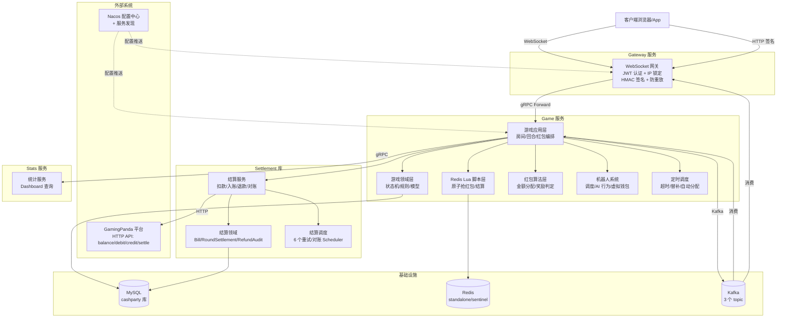

### 2.2 系统组成

| 模块 | 性质 | 职责 |
|------|------|------|
| **gateway** | 独立服务（WS+HTTP） | WebSocket 接入、JWT 认证、IP 防爆破、HMAC 签名、消息路由、跨节点广播分发 |
| **game** | 独立服务（gRPC） | 游戏核心逻辑、房间/回合编排、红包生成与抢夺、机器人调度、超时调度 |
| **settlement** | 库（被 game 装配） | 资金扣款、入账、退款、对账、重试补偿、异常处理、6 个定时任务 |
| **stats** | 独立服务（HTTP） | 统计查询、数据聚合、Dashboard 数据源 |
| **common** | 公共库 | 配置/MQ/Redis 锁/ID 生成/限流/签名/trace 等基础设施抽象 |
| **api/platform** | 平台客户端 | 对接外部 GamingPanda 平台（Debit/Credit/Settle/GetBalance） |
| **dashboard** | 前端应用 | Vue 3 + ECharts 运营数据可视化看板 |

### 2.3 核心数据流

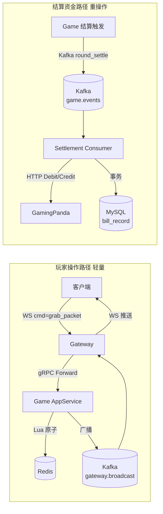

**关键设计**：抢红包路径只触达 Redis（单次 Lua），不触达 DB/MQ/平台 RPC，保证极致轻量与高并发；重操作（扣款/入账/结算）延迟到发包阶段或结算阶段异步处理。

---

## 3. 业务模块说明

### 3.1 房间管理模块

**模块职责**：管理房间的创建、加入、离开、座位选择、准备、排队替补等全生命周期，维护房间内玩家与观众状态。

| 功能 | 说明 |
|------|------|
| 创建房间 | 按房间配置（房费/人数/回合数）创建房间，初始状态 Idle |
| 加入房间 | 玩家以观众身份加入，可观看游戏 |
| 选座 | 观众选择空座位成为玩家，最多 5 人 |
| 取消座位 | 玩家取消座位回到观众席（游戏未开始时） |
| 玩家准备 | 玩家准备开局，全部准备后进入倒计时 |
| 自动匹配 | 系统为玩家分配有空座的房间 |
| 排队入座 | 观众排队等候空座，按入队时间先后替补 |
| 自动替补 | 玩家离座后自动从队列首位替补（仅真人，机器人不排队） |
| 离开房间 | 观众可直接离开；玩家游戏未开始可离开，游戏中离开触发罚款 |
| 重连 | 断线玩家重连恢复游戏状态 |

### 3.2 游戏玩法模块

**模块职责**：编排游戏会话与回合，驱动状态机流转，协调红包生成、抢夺、结算、超时处理。

| 功能 | 说明 |
|------|------|
| 开局 | 5 人准备后启动会话，系统发首轮红包 |
| 发红包 | 玩家手动发包（后续轮）或系统代发（首轮/奖励/超时/恢复） |
| 抢红包 | 玩家点击抢红包，Lua 原子分配预生成金额 |
| 回合结算 | 所有红包抢完或超时后，计算结果、广播、派发奖励、调度下轮 |
| 顺子奖励 | 触发条件满足时，系统派发等额本金奖励给所有玩家 |
| 豹子奖励 | 触发条件满足时，系统派发 10 倍本金奖励，并由系统代发下一轮 |
| 发包超时罚款 | 玩家轮到发包未发，罚款=房费，第二次踢出 |
| 抢包超时分配 | 抢包阶段超时，剩余红包自动分配给未抢玩家 |
| 游戏结束 | 达到最大回合数后结算排名，玩家转观众，会话派彩 |
| 中断恢复 | 异常中断后可恢复继续游戏 |

### 3.3 红包生成模块

**模块职责**：在发包时预生成红包金额数组，支持普通随机/顺子/豹子三种算法，由奖励控制器决定使用哪种。

| 功能 | 说明 |
|------|------|
| 普通随机生成 | 动态最小值 + 平均值 2 倍上界随机 + Fisher-Yates 洗牌 |
| 顺子生成 | 整数部分成公差 1 等差数列，小数部分均摊 + 随机余数分配 |
| 豹子生成 | 所有红包金额完全相同（需整除） |
| 奖励判定 | 保底机制 + 概率机制双重判定是否触发特殊奖励 |
| 结果缓存 | 按 RoundID 缓存生成结果，SetNX 保证幂等 |
| 配置热更新 | 通过 Nacos 推送原子更新配置（atomic.Pointer） |

### 3.4 机器人系统模块

**模块职责**：自动填充空座，模拟真人行为参与游戏，使用虚拟余额不触达真实资金。

| 功能 | 说明 |
|------|------|
| 机器人调度 | 扫描有空座的房间，从机器人池分配机器人入座 |
| AI 选座行为 | 机器人选择空座入座 |
| AI 准备行为 | 机器人自动准备 |
| AI 发包行为 | 轮到机器人发包时自动发送 |
| AI 抢包行为 | 机器人随机抢红包（Lua 内原子选包） |
| 虚拟钱包 | 机器人扣款/入账走虚拟余额，不调用平台 RPC |
| 延迟模拟 | 行为间随机延迟，模拟真人节奏 |

### 3.5 结算账务模块

**模块职责**：处理所有资金流转，包括扣款、入账、退款、罚款、对账，保证资金安全与最终一致性。

| 功能 | 说明 |
|------|------|
| 首回合扣款 | 所有玩家均摊房费，批量并发扣款 |
| 后续回合扣款 | 最小金额玩家承担房费 |
| 系统红包扣款 | 系统代发红包时从平台账户扣款 |
| 抢红包入账 | 回合结算时内部记账（不调平台） |
| 奖励入账 | 顺子/豹子奖励内部记账 |
| 会话派彩 | 会话结束后通过平台 Credit 真实入账 |
| 佣金入账 | 5% 佣金记入平台账户 |
| 罚款扣款 | 超时罚款扣到平台账户 |
| 罚款分红 | 替补超时罚款均分给剩余玩家 |
| 退款 | 首回合部分扣款失败时，为已成功扣款玩家退款 |
| 对账 | 定时检查结算状态不一致的回合 |
| 重试补偿 | 6 个 Scheduler 处理失败重试（扣款/入账/退款/对账） |
| 异常记录 | 资金异常写入 exception_record 表，供人工对账 |

### 3.6 网关接入模块

**模块职责**：作为系统统一入口，处理 WebSocket 接入、认证、消息路由、广播分发。

| 功能 | 说明 |
|------|------|
| WebSocket 接入 | `/ws` 升级 WebSocket 连接 |
| JWT 认证 | 首条消息 cmd=auth 携带 token，校验签名+过期 |
| IP 防爆破 | 认证失败次数超限锁定 IP |
| HMAC 签名 | 商户 HTTP API 强制签名校验 |
| 防重放 | 基于 nonce + Redis SetNX 防重放 |
| 消息路由 | 按 cmd 前缀路由到下游服务（game/stats） |
| gRPC 转发 | 透传 TraceID，5 秒超时 |
| 跨节点广播 | 消费 Kafka 广播消息，推送给本地连接用户 |
| 房间成员缓存 | 5 秒 TTL 缓存房间用户列表，优化广播性能 |

### 3.7 统计分析模块

**模块职责**：提供运营数据看板，支持多维度统计查询。

| 功能 | 说明 |
|------|------|
| Dashboard 总览 | 总收入、总玩家、总对局等汇总指标 |
| 趋势分析 | 按日/周/月的金额与对局趋势 |
| 金额分布 | 红包金额区间分布统计 |
| 房间排行 | 按活跃度/收入等维度排行 |

### 3.8 异步处理能力

| 功能 | 说明 |
|------|------|
| AsyncTaskRunner | 应用层异步任务管理，panic 恢复 + WaitGroup 跟踪 + 超时控制 |
| 结算异步触发 | 最后一抢后异步提交 settle_round 任务 |
| 广播异步化 | 广播消息异步发布，不阻塞主流程 |
| MQ 事件发布 | GameEvent/RoomEvent 异步发布到 Kafka |
| 超时调度 | TimeoutScheduler 定时检测超时并回调 |
| 结算重试调度 | 6 个 Scheduler 定时重试失败结算 |

---

## 4. 红包创建流程

### 4.1 红包创建概述

红包创建（发红包）由两种主体触发：
- **玩家手动发包**：后续轮由"上一轮最小金额玩家"发起
- **系统代发**：首轮、豹子奖励、超时强制、中断恢复四种场景

### 4.2 红包参数

| 参数 | 来源 | 说明 |
|------|------|------|
| 总金额 | 玩家输入或系统决定 | 单位：分（int64） |
| 红包数量 | 固定 5 个 | 等于最大玩家数 |
| 房间 ID | 当前房间 | 关联回合 |
| 回合 ID | Snowflake 生成 | 唯一标识本轮 |
| 发送者 ID | 玩家 ID 或 "0"（系统） | |
| 发送场景 | 1-5 五种场景 | 决定 SenderType 与扣款方式 |

### 4.3 金额计算

- **总金额**：玩家自定义输入（后续轮）或等于房费（系统代发）
- **佣金**：`commission = totalAmount × 5%`（CommissionConfig 默认 0.05）
- **实际金额**：`actualAmount = totalAmount - commission`（红包内可抢总额）

### 4.4 数量计算

红包数量固定为 **5 个**（等于 `MaxPlayers`），不支持自定义。

### 4.5 红包状态初始化

每个红包创建时初始化：
- `packet_id`：全局 INCR 生成
- `amount`：预生成的金额
- `position`：1-5 的位置序号
- `is_grabbed`：false
- `created_at`：当前时间戳
- 可用标记：`packet:available:{packetID} = "1"`（乐观锁）

### 4.6 数据保存

- **Redis**：红包详情（JSON）、可用标记、可用列表（List）、回合状态（Hash）
- **MySQL**：回合记录（Round 表，状态=Sending）
- **不立即写 DB**：红包明细延迟到结算时持久化

### 4.7 红包创建流程图

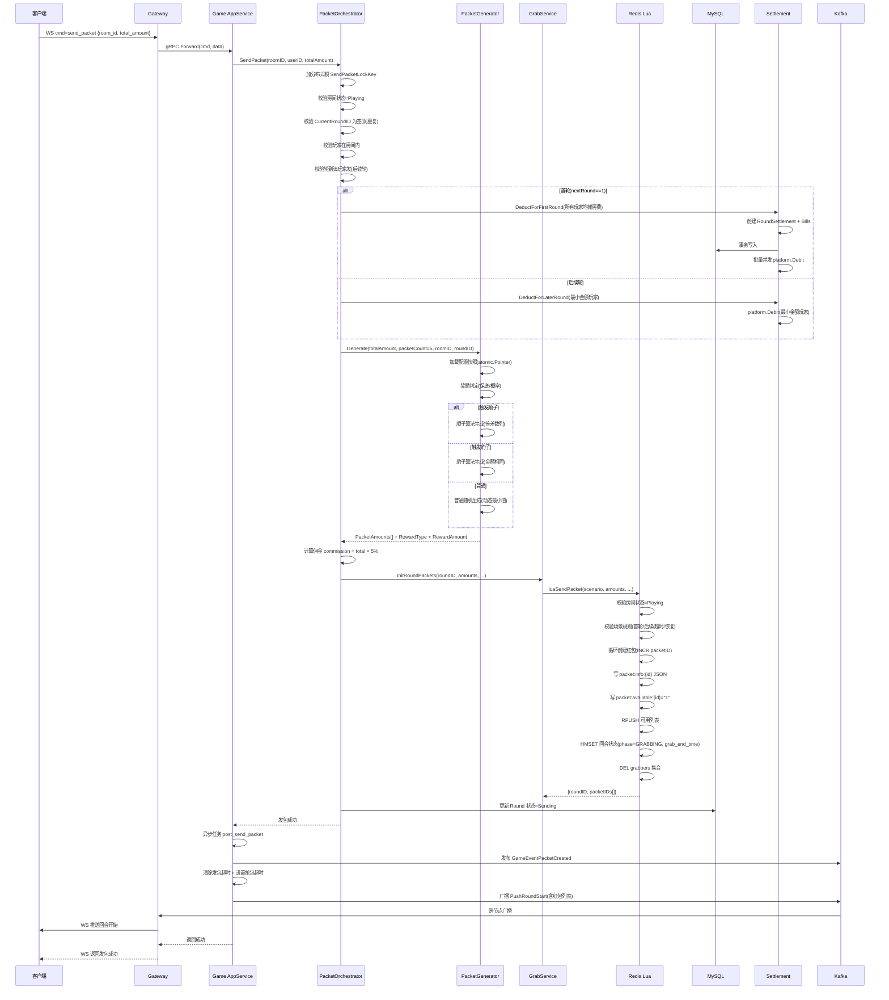

---

## 5. 抢红包流程

### 5.1 抢红包完整流程

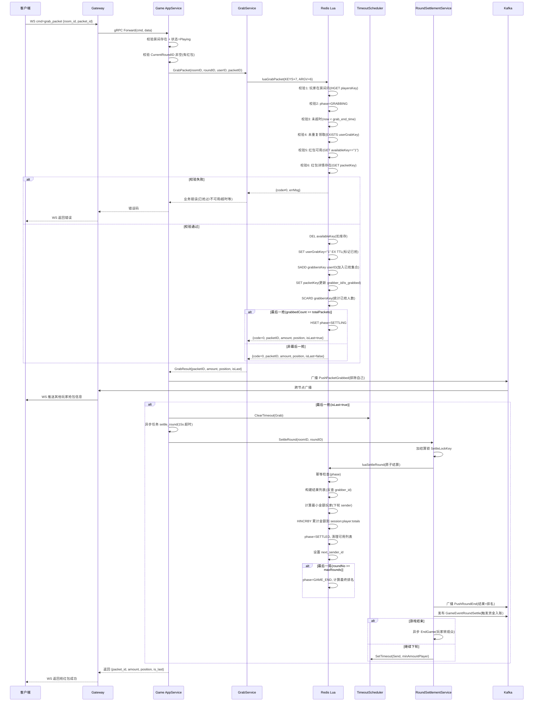

### 5.2 抢红包校验清单

| 序号 | 校验项 | 校验层 | 失败错误码 | 业务含义 |
|------|--------|--------|------------|----------|
| 1 | 房间存在 | 应用层 | CodeRoomNotFound | 房间不存在 |
| 2 | 房间状态=Playing | 应用层 | CodeGameNotStarted | 游戏未开始 |
| 3 | 当前回合 ID 非空 | 应用层 | CodeNoPacket | 无红包可抢 |
| 4 | 玩家在房间内 | Lua 原子 | CodeNotPlayer(60) | 非本房玩家 |
| 5 | phase=GRABBING | Lua 原子 | CodeNotInGrabbingPhase(40) | 非抢红包阶段 |
| 6 | 未超时 | Lua 原子 | CodeGrabTimeout(41) | 抢红包超时 |
| 7 | 未重复领取 | Lua 原子 | CodeAlreadyGrabbed(21) | 已抢过 |
| 8 | 红包可用 | Lua 原子 | CodeNoPacket(22) | 红包已被抢 |
| 9 | 红包详情存在 | Lua 原子 | CodePacketNotFound(23) | 红包数据丢失 |

### 5.3 机器人抢红包

机器人抢红包与真人区别：
- **选包方式**：Lua 内部原子选包（按随机偏移轮询可用列表），避免"查询→抢"两步竞态
- **随机数来源**：Go 侧预生成 `randOffset` 传入 Lua（Lua 禁用 math.random 防主从不一致）
- **后续流程**：与真人完全一致（广播、结算触发）

---

## 6. 红包规则

### 6.1 红包数量规则

- **固定数量**：每轮 5 个红包（等于 `MaxPlayers`）
- **数量上限**：算法支持 1-100，但业务固定为 5

### 6.2 红包金额规则

| 规则 | 说明 |
|------|------|
| 单包最小金额 | 1 分（`MinPacketAmount` 默认 1） |
| 总金额最小值 | 5 分（`PacketCount × MinPacketAmount`） |
| 总金额无上限 | 代码中无显式上限（仅 >0） |
| 单包最大金额 | 无绝对上限，受 `min(avgAmount×2, 剩余可分配)` 约束 |
| 金额单位 | 分（int64），全程整数运算无浮点 |
| 精度保证 | 普通算法最后红包取剩余全部；顺子余数前 N 个各 +1 分；豹子强制整除 |

### 6.3 抢红包规则

| 规则 | 说明 |
|------|------|
| 谁可以抢 | 仅当前房间内的玩家（观众不可抢） |
| 限制次数 | 每人每轮 1 次（`userGrabKey` 幂等标记） |
| 限制时间 | `grab_end_time` 截止（发包时设置，默认由配置决定） |
| 是否允许重复抢 | 不允许，已抢返回 `CodeAlreadyGrabbed` |
| 抢红包顺序 | 先到先得，无预分配 |
| 超时处理 | 超时后剩余红包自动分配给未抢玩家 |

### 6.4 游戏状态机

#### 6.4.1 房间状态机

```
Idle(0) → Waiting(1) → Playing(2) → Waiting(1) [会话结束]
                         ↓
                   Interrupted(4) [异常中断]
```

| 状态 | 值 | 含义 | 转换条件 |
|------|---|------|----------|
| Idle | 0 | 空闲 | 首位玩家入座 → Waiting |
| Waiting | 1 | 等待开局 | 全员准备 → Playing |
| Playing | 2 | 游戏中 | 会话结束 → Waiting；异常 → Interrupted |
| Interrupted | 4 | 中断 | 恢复 → Waiting/Idle |

#### 6.4.2 游戏阶段状态机（GamePhase）

```
WAITING(1) → COUNTDOWN(2) → ROUND_START(3) → GRABBING(4) 
  → SETTLING(5) → WAIT_SEND(6) → [下一回合 ROUND_START(3)]
                                     ↓
                              GAME_END(7) [达到最大回合数]
```

| 阶段 | 值 | 含义 | 转换条件 |
|------|---|------|----------|
| WAITING | 1 | 等待开局 | 全员准备 → COUNTDOWN |
| COUNTDOWN | 2 | 开局倒计时 | 倒计时结束 → ROUND_START |
| ROUND_START | 3 | 回合开始 | 红包创建 → GRABBING |
| GRABBING | 4 | 抢红包 | 最后一抢/超时 → SETTLING |
| SETTLING | 5 | 结算中 | 结算完成 → WAIT_SEND/GAME_END |
| WAIT_SEND | 6 | 等待发包 | 玩家发包/超时 → ROUND_START |
| GAME_END | 7 | 游戏结束 | 终态 |

#### 6.4.3 回合状态机

```
Pending(0) → Sending(1) → Grabbing(2) → Ended(3) [正常]
                  ↓            ↓
              Failed(4)    Failed(4) [异常]
```

#### 6.4.4 结算状态机（RoundSettlement）

```
Deducting(0) → Deducted(1) → Credited(6) [终态：已派彩]
      ↓             ↓
  Failed(5)     Failed(5) [终态：失败]
```

| 状态 | 值 | 含义 |
|------|---|------|
| Deducting | 0 | 扣款中 |
| Deducted | 1 | 扣款完成 |
| Failed | 5 | 失败 |
| Credited | 6 | 已派彩（终态） |

---

## 7. 金额分配规则

### 7.1 金额分配概述

红包金额在**发包时预生成**并写入 Redis，抢红包时直接读取，不实时计算。金额分配由奖励控制器决定使用哪种算法。

### 7.2 奖励判定机制

奖励判定采用**保底 + 概率**双重机制：

#### 7.2.1 保底机制（Guarantee）

| 规则 | 说明 |
|------|------|
| 触发条件 | 房间启用 `GuaranteeEnabled` 且本 session 未中过该类型奖励 |
| 触发概率 | `1 / 剩余轮数`（剩余轮数越少概率越高） |
| 最后一轮 | 100% 触发（确保一个 session 周期内必出奖励） |
| 频率限制 | 一个 session 内同类型（顺子/豹子）只保底一次（24h TTL 标记） |

#### 7.2.2 概率机制（Probability）

| 规则 | 说明 |
|------|------|
| 全局开关 | `GlobalSwitchEnabled` 必须开启（默认关闭） |
| 利润率门控 | 当前利润率 ≥ `ProfitRatioThreshold`（默认 5%）才允许触发 |
| 利润率计算 | `(totalBet - totalWin - totalReward) / totalBet` |
| 触发方式 | 分段随机：先判豹子概率，再判顺子概率，互斥 |
| 业务含义 | 平台盈利达标才发奖励（"亏了才发"风控策略） |

### 7.3 普通随机算法

**适用场景**：未触发特殊奖励时的默认算法

**算法步骤**：
1. 计算动态最小金额：`minAmount = randomRange(configMin, avgAmount/3)`
2. 随机选定一个红包固定为 minAmount
3. 剩余金额分配：每个红包上界 `min(avgAmount×2, 剩余可分配)`，下界 `minAmount+1`
4. 最后一个红包取剩余全部（保证 sum 精确等于 totalAmount）
5. Fisher-Yates 洗牌打乱顺序

**特点**：制造金额差距，最小值不超过均值的三分之一

### 7.4 顺子算法（Straight）

**触发条件**：奖励判定为顺子 + 总金额 ≥ `(1+2+...+n)×100` 分

**算法逻辑**：
1. 计算最小整数和 `minIntSum = (1+n)×n/2`（即 1+2+...+n 元）
2. 起始整数 `startInt = max(1, (totalYuan - minIntSum) / n)`
3. 整数部分按等差数列分配：`startInt, startInt+1, ..., startInt+n-1`（元）
4. 小数部分（分）均摊：`avgDecimal = remainingAmount / n`
5. 余数处理：前 `extraDecimal` 个红包各 +1 分（位置由 crypto/rand 随机决定）

**奖励金额**：`rewardAmount = totalAmount × 1.0`（返还本金级别）

**判定规则**：红包金额的**整数部分**（`/100`）排序后为公差 1 的等差数列

**示例**（总金额 1500 分，5 个红包）：
- 整数部分：1, 2, 3, 4, 5 元（和=15 元=1500 分，无小数余数）
- 金额：100, 200, 300, 400, 500 分（随机排列）
- 奖励：1500 分

### 7.5 豹子算法（Leopard）

**触发条件**：奖励判定为豹子 + `totalAmount % packetCount == 0` + `baseAmount >= minPacketAmount`

**算法逻辑**：
1. 计算基础金额 `baseAmount = totalAmount / packetCount`
2. 所有红包金额均等于 `baseAmount`

**奖励金额**：`rewardAmount = totalAmount × 10.0`（10 倍本金，高价值奖励）

**判定规则**：所有红包金额完全相同（长度 ≥ 2）

**特殊后续**：豹子奖励触发后，下一轮由**系统代发**（`next_sender_id = "0"`）

**示例**（总金额 500 分，5 个红包）：
- 金额：100, 100, 100, 100, 100 分
- 奖励：5000 分（10 倍本金）

### 7.6 算法选择决策树

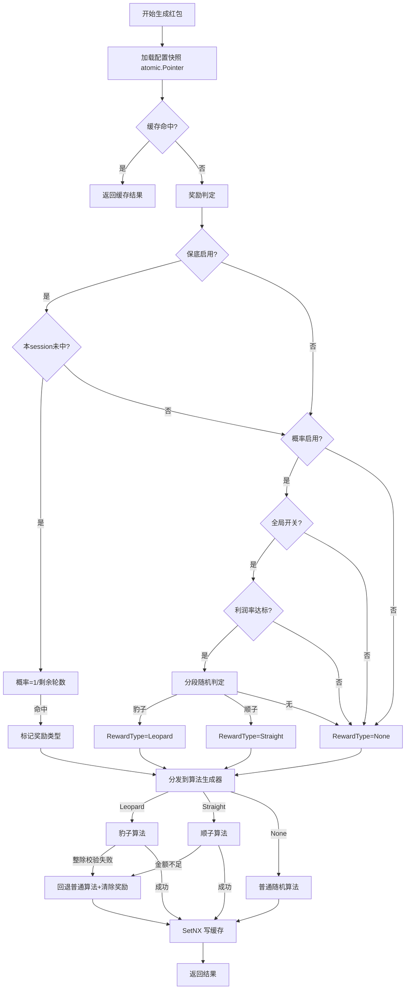

### 7.7 随机数安全

| 场景 | 随机数源 | 原因 |
|------|----------|------|
| 红包金额分配 | crypto/rand | 资金相关，防预测防作弊 |
| 奖励触发判定 | crypto/rand | 资金相关，防推断触发时机 |
| 顺子余数位置 | crypto/rand | 资金相关，防推断大小 |
| 机器人 AI 行为 | math/rand | 非资金，性能优先 |
| 头像随机选择 | math/rand | UI 相关，非资金 |
| 机器人延迟模拟 | math/rand | 非资金，性能优先 |

---

## 8. 高并发设计

### 8.1 并发控制

#### 8.1.1 抢红包并发控制（无锁设计）

**核心机制**：Redis 单线程 + Lua 脚本原子性，**不使用分布式锁**

**设计原理**：
- 红包库存（`packet:available:{packetID}`）和用户已抢标记（`round:grabbed:{roundID}:{userID}`）都是单 Key
- Redis 单线程执行 Lua 脚本期间不会被其他命令打断
- 所有"校验→扣减库存→标记已抢→更新状态"在单个 Lua 脚本内完成

**防超卖（同一红包被多人抢）**：
```
Lua 内：
  GET availableKey 检查 =="1"    → 第一个请求通过
  DEL availableKey               → 删除标记
  第二个请求 GET 返回 nil         → 返回 LuaErrPacketNotAvailable
```

**防重复领取（同一用户抢多个）**：
```
Lua 内：
  EXISTS userGrabKey             → 第一次返回 0，通过
  SET userGrabKey "1" EX TTL     → 标记已抢
  第二次 EXISTS 返回 1            → 返回 LuaErrAlreadyGrabbed
```

#### 8.1.2 发红包并发控制（分布式锁）

发红包使用分布式锁 `SendPacketLockKey(roomID, userID)`：
- 防止同一玩家重复发包
- 锁内完成所有校验与发包
- 锁外异步广播与事件发布

#### 8.1.3 结算并发控制（分布式锁）

结算使用分布式锁 `SettleLockKey(roomID, roundID)`：
- 保证同一回合结算串行
- 与超时自动分配互斥
- 锁内二次检查幂等

#### 8.1.4 扣款并发控制（信号量 + 分布式锁）

- 首回合批量扣款使用信号量控制并发（默认 `maxConcurrentDeduct=20`）
- 每个玩家扣款独立 goroutine + panic recovery
- 跨玩家扣款通过 `FirstRoundDeductLockKey(sessionID)` 互斥

### 8.2 防重复领取（幂等机制）

**三重幂等防线**：

| 防线 | 机制 | Key/字段 | 作用 |
|------|------|----------|------|
| 第一道 | Redis Key 存在性检查 | `round:grabbed:{roundID}:{userID}` | 抢红包时 Lua 原子检查 |
| 第二道 | 红包可用标记删除 | `packet:available:{packetID}` | 红包被抢后标记删除 |
| 第三道 | 结算阶段幂等 | `phase` 字段检查 | 已结算返回 Idempotent |

**结算幂等三层防线**：

| 防线 | 机制 | 说明 |
|------|------|------|
| 第一道 | Redis 分布式锁 | `SettleLockKey` 串行化 |
| 第二道 | 状态机早返回 | `Status == Credited` 直接返回 |
| 第三道 | BillRecord 唯一性 | `GetBillByRoundTypeAndUser` 查询已存在账单 |

**消息消费幂等**：

| 消费者 | 幂等 Key | TTL | 机制 |
|--------|----------|-----|------|
| GameEventConsumer | `GameEventProcessedKey(traceID)` | 7 天 | Redis SetNX 抢占 |
| RoomEventConsumer | `RoomEventProcessedKey(eventID)` | 7 天 | Redis SetNX 抢占 |

### 8.3 数据一致性

#### 8.3.1 红包状态流转（Redis → DB → MQ）

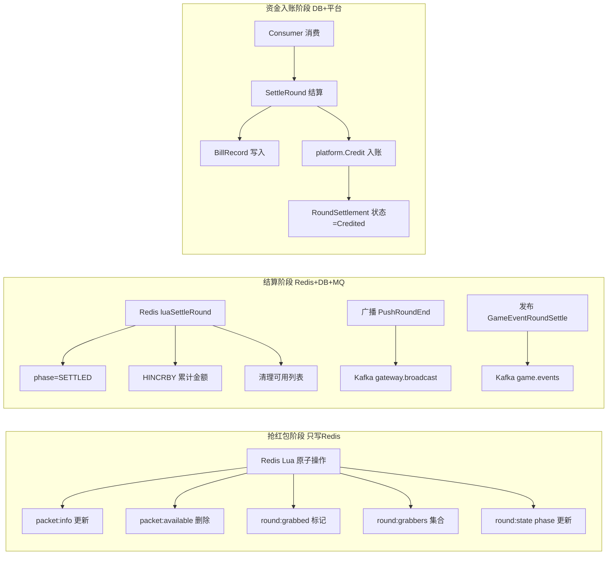

#### 8.3.2 异常处理

| 异常场景 | 处理策略 |
|----------|----------|
| Redis Lua 执行失败 | 直接返回错误，不写脏数据，无降级 |
| 抢红包超时 | TimeoutScheduler 触发 AutoDistribute 自动分配剩余红包 |
| 发包超时 | 罚款 + ForceSendPacketForPlayer 系统强制发包 |
| 扣款失败 | 标记 Bill Failed + 创建 ExceptionRecord + 触发重试 Scheduler |
| 扣款部分失败 | 已成功扣款玩家创建 RefundAudit 退款单 |
| 结算锁获取失败 | 仅记录日志，依赖幂等性由其他实例完成 |
| Kafka 消费失败 | fail-closed 不提交 offset，触发重试 + DLQ |
| 平台 RPC 失败 | 指数退避重试，失败标记 Failed + 异常记录 |
| 金额解析失败 | fail-closed 标记 Failed，绝不标记 Success |

#### 8.3.3 最终一致性保证

- **幂等设计**：所有重试操作都幂等（状态机 + 唯一索引 + Redis 标记）
- **补偿机制**：6 个 Scheduler 定时重试失败操作
- **对账机制**：SettlementCheckService 定时检查结算状态不一致
- **异常记录**：所有资金异常写入 exception_record 供人工对账

---

## 9. 安全机制

### 9.1 金额安全

| 安全机制 | 实现方式 |
|----------|----------|
| 精度处理 | 全程 int64 整数运算（单位：分），无浮点 |
| 防止负数 | 校验 `TotalAmount > 0`、`PacketCount > 0` |
| 防止超额 | 普通算法单包上界 `min(avgAmount×2, 剩余可分配)` |
| 总额校验 | `ValidatePackets` 检查 sum == totalAmount |
| 豹子整除校验 | `totalAmount % packetCount == 0` 强制整除 |
| 顺子最小值校验 | `totalAmount >= (1+n)×n/2×100` 分 |
| 随机数安全 | 资金相关用 crypto/rand 防预测 |
| 预生成缓存 | SetNX 保证同 RoundID 幂等 |

### 9.2 状态安全

| 安全机制 | 实现方式 |
|----------|----------|
| 状态机守卫 | Bill/RoundSettlement/RefundAudit 的 `TransitionTo` 校验合法转换 |
| 非法状态拒绝 | 非法转换返回 error，fail-closed |
| Lua phase 校验 | 抢红包前校验 phase=GRABBING，结算前校验 phase |
| 幂等返回 | 已结算返回 Idempotent(2)，视为成功不重复处理 |
| 乐观锁 | DB UPDATE 包含 `WHERE status = ?` 防状态覆盖 |

### 9.3 用户安全

| 安全机制 | 实现方式 |
|----------|----------|
| 防重复领取 | `round:grabbed:{roundID}:{userID}` Redis Key 存在性检查 |
| 防非玩家抢 | Lua 内 `HGET playersKey userID` 校验 |
| 防超时抢 | Lua 内 `now < grab_end_time` 校验 |
| 防非阶段抢 | Lua 内 `phase == GRABBING` 校验 |
| 防爆破 | IP 失败计数 + 锁定（MaxAttempts） |
| 防重放 | nonce + Redis SetNX（TTL 10 分钟） |
| 防时序攻击 | hmac.Equal 常数时间比较 |
| 防算法篡改 | JWT 校验签名方法必须是 HMAC |
| 限流保护 | 滑动窗口限流（Redis Lua） |
| 资金操作限流 | grab 命令独立限流策略（可配置 fail-open/fail-closed） |

### 9.4 资金安全

| 安全机制 | 实现方式 |
|----------|----------|
| fail-closed 原则 | 金额解析失败、RPC 失败标记 Failed，绝不标记 Success |
| 短事务原则 | 事务仅包裹 DB 写入，禁止事务内 RPC |
| 双边记账 | 每笔扣款/入账都有配对 BillRecord |
| BizOrderNo 确定性 | 基于 roundTraceID + billType + userID 生成，保证幂等 |
| 机器人虚拟通道 | 机器人扣款/入账走虚拟余额，不调平台 RPC |
| 异常记录 | 所有资金异常写入 exception_record 供人工对账 |
| 退款机制 | 首回合部分失败时为已扣款玩家退款 |
| 对账机制 | SettlementCheckService 定时检查不一致 |
| 补偿机制 | 6 个 Scheduler 重试失败操作 |

---

## 10. 数据模型

### 10.1 核心实体关系

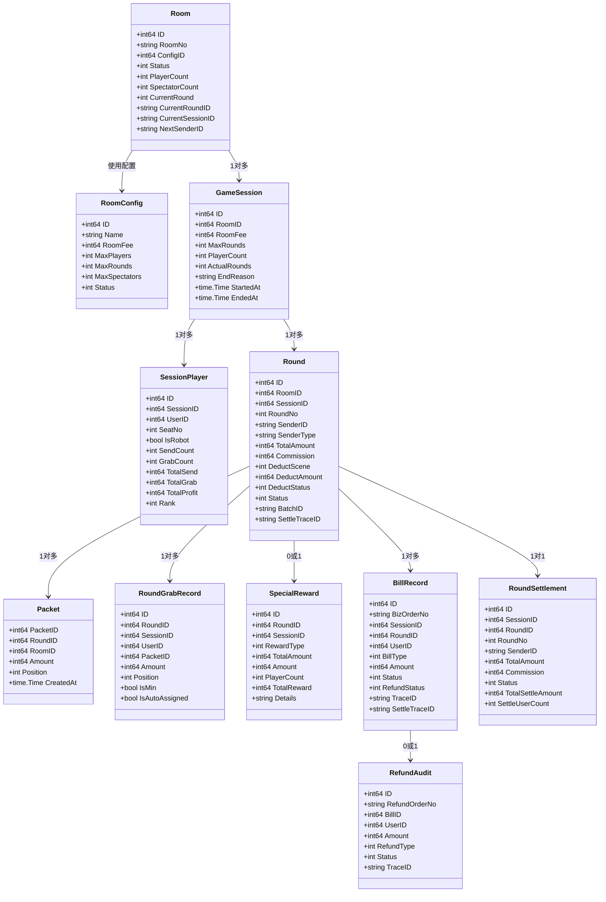

### 10.2 数据库模型

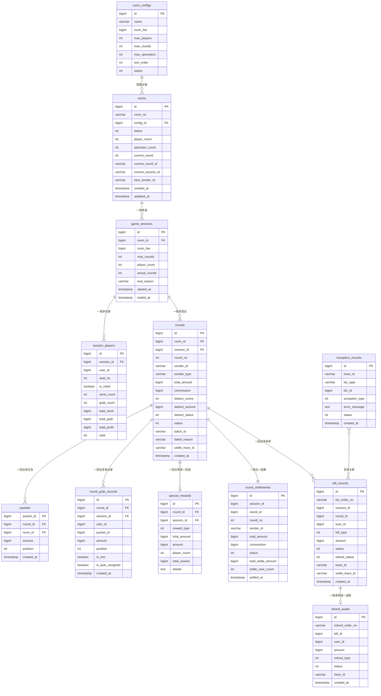

### 10.3 Redis 模型

#### 10.3.1 红包相关 Key

| Key 模式 | 数据类型 | TTL | 用途 |
|----------|----------|-----|------|
| `cashparty:packet:info:{packetID}` | String(JSON) | 24h | 红包详情（含金额、位置、抢到者） |
| `cashparty:packet:available:{packetID}` | String("1") | 24h | 红包可用标记（乐观锁） |
| `cashparty:global:packet_id` | String(INCR) | 永久 | 全局红包 ID 计数器 |
| `cashparty:round:packets:{roundID}` | String(JSON) | - | 红包生成结果缓存（幂等） |
| `cashparty:round:available_packets:{roundID}` | List | - | 回合可用红包 ID 列表 |
| `cashparty:round:grabbers:{roundID}` | Set | - | 回合抢红包者集合 |
| `cashparty:round:grabbed:{roundID}:{userID}` | String("1") | 24h | 用户本轮已抢标记（幂等） |
| `cashparty:round:state:{roundID}` | Hash | 24h | 回合状态（phase/sender/amount 等） |
| `cashparty:round:reward:{roundID}` | - | - | 轮次奖励信息 |

#### 10.3.2 房间相关 Key

| Key 模式 | 数据类型 | TTL | 用途 |
|----------|----------|-----|------|
| `cashparty:room:hash:{roomID}` | Hash | 24h | 房间元数据（status/players/round 等） |
| `cashparty:room:players:{roomID}` | Hash | 24h | 房间玩家列表（userID→JSON） |
| `cashparty:room:spectators:{roomID}` | Hash | 24h | 房间观众列表 |
| `cashparty:room:seats:{roomID}` | BitMap | 24h | 座位占用情况 |
| `cashparty:room:seat_owner:{roomID}` | Hash | 24h | 座位→玩家映射 |
| `cashparty:room:queue:{roomID}` | ZSet | 24h | 排队队列（score=入队时间） |

#### 10.3.3 结算相关 Key

| Key 模式 | 数据类型 | TTL | 用途 |
|----------|----------|-----|------|
| `cashparty:session:{sessionID}:player:totals` | Hash | - | 会话玩家累计金额 |
| `cashparty:lock:send_packet:{roomID}:{userID}` | String | - | 发红包锁 |
| `cashparty:lock:settle:{roomID}:{roundID}` | String | - | 结算锁 |
| `cashparty:settle:done:{roundID}` | String | - | 结算完成标记 |

#### 10.3.4 红包详情 JSON 结构

```json
{
  "packet_id": 12345,
  "room_id": "room_xxx",
  "round_id": "round_xxx",
  "sender_id": "user_xxx",
  "sender_type": "player",
  "amount": 100,
  "position": 1,
  "is_grabbed": false,
  "created_at": 1690000000,
  "grabber_id": "user_yyy",
  "grabbed_at": 1690000001,
  "auto_assigned": false
}
```

#### 10.3.5 回合状态 Hash 结构

| 字段 | 类型 | 含义 |
|------|------|------|
| `round_id` | string | 回合 ID |
| `round_no` | number | 回合序号 |
| `sender_id` | string | 发红包者 ID |
| `sender_type` | string | 发送者类型 |
| `total_amount` | number | 总金额 |
| `commission` | number | 佣金 |
| `actual_amount` | number | 实际金额 |
| `packet_count` | number | 红包数量 |
| `phase` | string | 阶段（GRABBING/SETTLING/SETTLED/GAME_END） |
| `grab_end_time` | number | 抢红包截止时间 |
| `reward_type` | number | 奖励类型 |
| `reward_amount` | number | 奖励金额 |
| `settled_at` | number | 结算时间 |

---

## 11. 消息模型

### 11.1 Kafka Topics

| Topic 常量 | Topic 名称 | 用途 |
|------------|------------|------|
| `TopicGameEvents` | `cashparty.game.events` | 游戏事件（会话开始/红包创建/回合结算/会话结束） |
| `TopicRoomEvents` | `cashparty.room.events` | 房间事件（座位/观战/准备/替换等） |
| `TopicGatewayBroadcast` | `cashparty.gateway.broadcast` | 跨节点广播消息 |

### 11.2 GameEvent 事件类型

| 事件类型 | 触发时机 | Payload 关键字段 |
|----------|----------|------------------|
| `session_start` | 一局游戏会话开始 | room_no, config_id, room_fee, max_rounds, players |
| `packet_created` | 发红包成功 | sender_id, total_amount, commission, packets |
| `round_settle` | 单轮抢红包结束结算 | round_no, total_amount, commission, results, min_player_id, reward_type, reward_amount |
| `session_end` | 整局会话结束 | actual_rounds, end_reason, final_results（含 total_profit, rank） |

**事件 Key 策略**：`roomID_sessionID`（保证同会话事件有序落同分区）

**消费端处理**：GameEventConsumer 消费 `round_settle` 事件触发资金入账（Credit）

### 11.3 RoomEvent 事件类型

| 事件类型 | 触发时机 |
|----------|----------|
| `spectator_join` | 观众进入房间 |
| `spectator_leave` | 观众离开房间 |
| `seat_select` | 玩家选座 |
| `seat_cancel` | 玩家取消座位 |
| `player_ready` | 玩家准备 |
| `spectator_kick` | 观众被踢 |
| `player_reconnect` | 玩家重连 |
| `queue_join` | 加入等待队列 |
| `queue_leave` | 离开等待队列 |
| `substitute` | 玩家替换（掉线替补） |

**事件 Key 策略**：`roomID`（保证同房间事件有序落同分区）

**消费端处理**：RoomEventConsumer 消费所有事件，统一走 `syncRoomCounts` 同步房间计数到 DB

### 11.4 广播消息流程

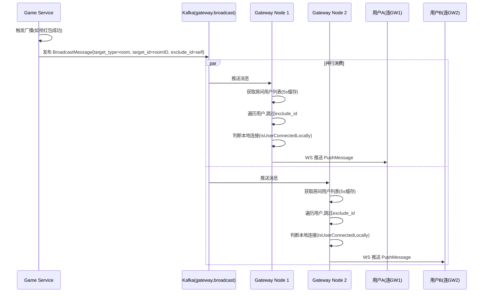

**广播消息结构**：
```json
{
  "event_id": "evt_xxx",
  "trace_id": "trace_xxx",
  "timestamp": 1690000000,
  "version": "1.0",
  "target_type": "room",
  "target_id": "room_xxx",
  "exclude_id": "user_self",
  "event": "packet_grabbed",
  "data": { /* 业务数据 */ }
}
```

**PushMessage 格式**（推送给客户端）：
```json
{
  "event_id": "evt_xxx",
  "trace_id": "trace_xxx",
  "timestamp": 1690000000,
  "version": "1.0",
  "type": "packet_grabbed",
  "data": { /* 业务数据 */ }
}
```

### 11.5 消息消费幂等与容错

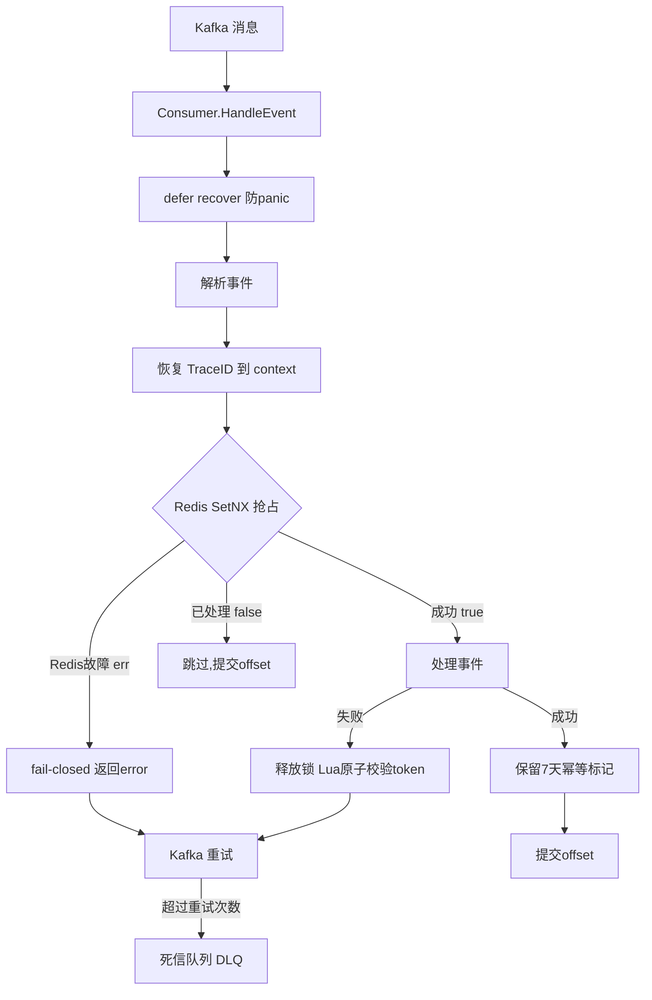

**关键设计**：
- **fail-closed**：Redis 故障时返回 error 触发 Kafka 重试，不丢消息
- **安全释放锁**：通过 Lua 脚本原子校验 token 后才 DEL，防止 TTL 过期后误删他人锁
- **7 天幂等标记**：成功处理后保留标记 7 天，防止重复消费

### 11.6 完整事件流转

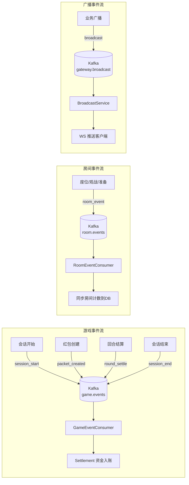

---

## 12. 用户流程

### 12.1 完整用户体验流程

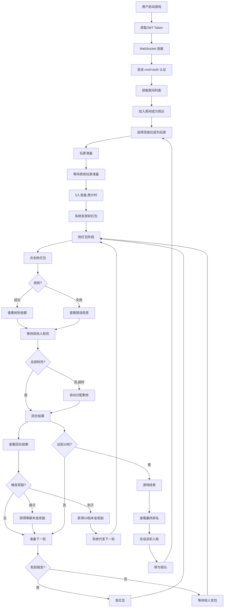

### 12.2 关键用户操作命令

| 操作 | WebSocket 命令 | 说明 |
|------|----------------|------|
| 认证 | `cmd=auth` | 首条消息，携带 JWT |
| 获取房间列表 | `cmd=get_room_list` | 查询可加入的房间 |
| 获取房间类型 | `cmd=get_room_type_list` | 查询房间配置 |
| 自动匹配 | `cmd=auto_match` | 系统分配房间 |
| 加入房间 | `cmd=join_room` | 以观众身份加入 |
| 离开房间 | `cmd=leave_room` | 离开房间 |
| 选座 | `cmd=select_seat` | 观众→玩家 |
| 取消座位 | `cmd=cancel_seat` | 玩家→观众 |
| 准备 | `cmd=player_ready` | 准备开局 |
| 发红包 | `cmd=send_packet` | 玩家发包 |
| 抢红包 | `cmd=grab_packet` | 抢红包 |
| 查询余额 | `cmd=get_user_balance` | 查询平台余额 |
| 查询历史 | `cmd=get_player_history` | 查询游戏历史 |
| 查询统计 | `cmd=get_player_stats` | 查询个人统计 |
| 重连 | `cmd=reconnect` | 断线重连 |
| 排队 | `cmd=enqueue` | 加入等待队列 |
| 退出排队 | `cmd=dequeue` | 退出等待队列 |
| 心跳 | `cmd=ping` | 保活（网关本地处理） |

### 12.3 异常用户流程

#### 12.3.1 发包超时流程

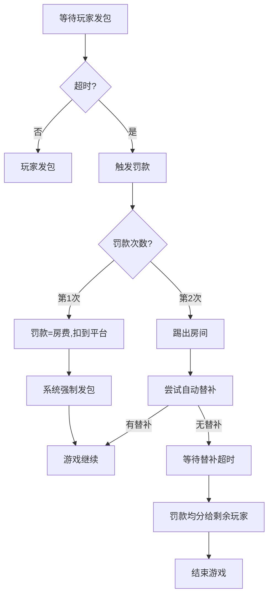

#### 12.3.2 抢包超时流程

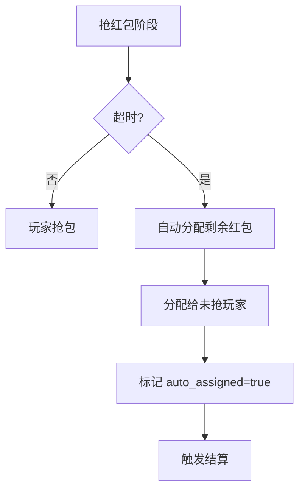

#### 12.3.3 扣款失败流程

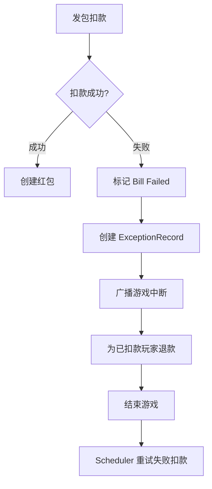

#### 12.3.4 断线重连流程

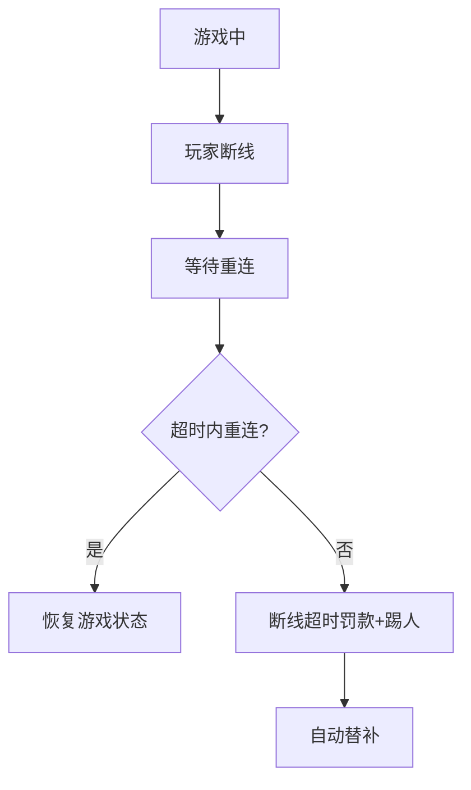

### 12.4 资金流转全景

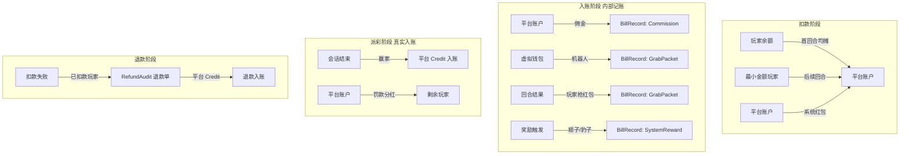

### 12.5 定时任务清单

| Scheduler | 职责 | 必要性 |
|-----------|------|--------|
| TimeoutScheduler | 检测发包/抢包/替补超时并回调 | 必需：驱动游戏状态机超时转换 |
| CreditRetryScheduler | 重试失败的会话派彩（Credit） | 必需：保证资金最终入账 |
| GameSettleRetryScheduler | 重试失败的回合结算 | 必需：保证结算最终完成 |
| GameSettleTimeoutScheduler | 处理超时未结算的回合 | 必需：兜底防止回合卡死 |
| RefundProcessScheduler | 处理待审批的退款单 | 必需：保证退款最终执行 |
| SettlementCheckScheduler | 对账检查结算状态不一致 | 必需：发现并修复资金异常 |
| VirtualBalanceSyncScheduler | 同步机器人虚拟余额到 DB | 必需：持久化机器人余额 |
| RobotScheduler | 扫描有空座的房间分配机器人 | 必需：保证游戏连续性 |

---

## 附录

### A. 错误码映射表

| Lua 错误码 | 常量 | 业务码 | 含义 |
|------------|------|--------|------|
| 0 | LuaErrSuccess | - | 成功 |
| 2 | LuaErrIdempotent | - | 幂等成功（已处理） |
| 1 | LuaErrRoomNotFound | CodeRoomNotFound | 房间不存在 |
| 6 | LuaErrGameNotInPlaying | CodeGameNotStarted | 游戏未开始 |
| 20 | LuaErrPacketsAlreadyExist | CodePacketsAlreadyExist | 红包已存在 |
| 21 | LuaErrAlreadyGrabbed | CodeAlreadyGrabbed | 已抢过 |
| 22 | LuaErrPacketNotAvailable | CodeNoPacket | 红包不可用 |
| 23 | LuaErrPacketInfoNotFound | CodePacketNotFound | 红包详情不存在 |
| 40 | LuaErrNotInGrabbingPhase | CodeNotInGrabbingPhase | 非抢红包阶段 |
| 41 | LuaErrGrabTimeout | CodeGrabTimeout | 抢红包超时 |
| 51 | LuaErrNotYourTurn | CodeNotYourTurn | 未轮到你发 |
| 60 | LuaErrOnlyPlayerCanGrab | CodeNotPlayer | 仅玩家可抢 |

### B. 发送者类型与场景

| 场景 | 值 | SenderType | 扣款方式 | 说明 |
|------|---|------------|----------|------|
| 首轮 | 1 | system | 所有玩家均摊房费 | 系统代发首轮 |
| 玩家手动 | 2 | player | 最小金额玩家承担房费 | 玩家主动发包 |
| 超时强制 | 3 | system_forced | 系统账户（罚款金额） | 发包超时系统代发 |
| 中断恢复 | 4 | system_resume | 系统账户 | 恢复中断游戏 |
| 豹子奖励 | 5 | system | 系统账户 | 豹子触发系统代发 |

### C. BillType 账单类型

| 类型 | 值 | 说明 |
|------|---|------|
| FirstRoundDeduct | 2 | 首回合平摊扣款 |
| GrabPacket | 3 | 抢红包收入 |
| LaterRoundDeduct | 4 | 后续回合扣款 |
| Commission | 7 | 佣金收入 |
| PenaltyIncome | 8 | 罚款收入 |
| SystemPacket | 9 | 系统红包 |
| PenaltyDistribute | 10 | 罚款分红 |
| SystemReward | 11 | 系统奖励 |
| SessionCredit | 12 | 会话级派彩 |
| GameSettle | 13 | 游戏级结算 |

### D. 罚款类型

| 类型 | 值 | 触发场景 | 罚款金额 | 踢人 |
|------|---|----------|----------|------|
| SendTimeout | 1 | 发红包超时 | = 房费 | 第 2 次踢出 |
| LeaveDuringGame | 2 | 游戏中离开 | = 房费 | 是 |
| DisconnectTimeout | 3 | 断线超时 | = 房费 | 是 |

---

> 本文档所有结论均可追溯至具体代码文件与函数，基于源码逆向生成，未参考任何外部文档。
